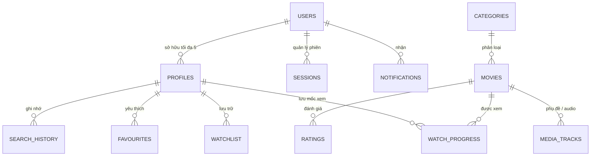

# 🎬 CINEVORA — Enterprise Movie Streaming & Discovery Platform

> **Cinevora** là nền tảng phát trực tuyến và khám phá điện ảnh toàn diện (Full-Stack Movie Streaming & Discovery Platform), được thiết kế và xây dựng theo chuẩn mực kiến trúc doanh nghiệp phân tán. Hệ thống đánh dấu bước chuyển đổi kỹ thuật ấn tượng từ một ứng dụng **Java CLI thuần OOP** (sử dụng thuật toán tự cài đặt) sang hệ thống **Web Cloud-Native**: **Spring Boot 3.5.16 / Java 21 LTS**, **PostgreSQL 16 + Flyway V10**, **React 18 + Vite + TypeScript**, kiến trúc bảo mật **Dual-Token HttpOnly**, đóng gói **Docker Compose** và tự động hóa toàn trình qua **GitHub Actions CI/CD**.

---

<div align="center">

### 🌐 HỆ THỐNG ĐANG HOẠT ĐỘNG TRỰC TIẾP (LIVE PRODUCTION)
### 🔗 **Website**: [https://cinevora.store](https://cinevora.store) &nbsp;|&nbsp; 🔌 **API**: [https://api.cinevora.store/api/v1](https://api.cinevora.store/api/v1) &nbsp;|&nbsp; ❤️ **Health**: [https://api.cinevora.store/actuator/health](https://api.cinevora.store/actuator/health)

<br/>

[](https://cinevora.store)
[](https://github.com/thach09/cinevora/actions/workflows/backend-ci.yml)
[](https://github.com/thach09/cinevora/actions/workflows/frontend-ci.yml)
[](https://github.com/thach09/cinevora/actions/workflows/integration-ci.yml)
[](https://github.com/thach09/cinevora/actions/workflows/security-ci.yml)

[](https://www.oracle.com/java/)
[](https://spring.io/projects/spring-boot)
[](https://www.postgresql.org/)
[](https://react.dev/)
[](https://www.typescriptlang.org/)
[](https://vitejs.dev/)
[](https://tailwindcss.com/)
[](https://www.docker.com/)
[](LICENSE)

</div>

---

## 📌 Bảng điều khiển kiểm định & Trạng thái phát hành (Quality & Audit Dashboard)

Dự án đã hoàn tất đợt thẩm định độc lập (**Independent QA & Security Audit**) và quá trình khắc phục triệt để (**Final Remediation**). Hệ thống hiện đã được cấu hình và triển khai thành công trên môi trường Production thực tế với tên miền riêng cùng kiến trúc **Same-Site HTTPS** chuẩn mực.

| Hạng mục kiểm định | Trạng thái kỹ thuật | Minh chứng / Bằng chứng thực tế |
|:---|:---:|:---|
| **Trạng thái Triển khai** | **LIVE (PRODUCTION)** | Hoạt động chính thức tại [cinevora.store](https://cinevora.store) với HTTPS đầy đủ |
| **Kiến trúc Tên miền** | **SAME-SITE HTTPS** | `cinevora.store` (Web) + `api.cinevora.store` (API) — bảo đảm tính toàn vẹn Cookie |
| **Cơ sở dữ liệu (Flyway)** | **PASS (V1–V10)** | 10 script migration tuần tự thực thi sạch, không lỗi trên PostgreSQL 16 |
| **Backend Test Suite** | **PASS (36 + 11 Gated)** | 100% test vượt qua (Unit, Concurrency, Security Integration trên DB thật) |
| **Frontend E2E Suite** | **PASS (7/7 + 1/1 Gate)** | Playwright test tự động trên trình duyệt thật (Auth, Streaming, Admin CMS) |
| **Kiểm toán An toàn thông tin** | **HARDENED** | Trivy 0 CVE, npm audit 0 lỗi, Gitleaks clean, OWASP ZAP baseline thông qua |
| **Kiểm soát Đồng thời (Concurrency)** | **VERIFIED** | Khóa bi quan `PESSIMISTIC_WRITE` (giới hạn 5 profiles) & Atomic JPQL Counters |
| **Xác thực Dual-Token** | **VERIFIED** | Memory-only Access Token + `HttpOnly; SameSite=Lax` Refresh Cookie xoay vòng |

> [!NOTE]
> Toàn bộ báo cáo kỹ thuật chuyên sâu được lưu trữ tại [FINAL_REMEDIATION_REPORT.md](docs/verification/FINAL_REMEDIATION_REPORT.md), [FINAL_INDEPENDENT_QA_SECURITY_AUDIT.md](docs/verification/FINAL_INDEPENDENT_QA_SECURITY_AUDIT.md) và [DEPLOYMENT_RUNBOOK.md](docs/deployment/DEPLOYMENT_RUNBOOK.md).

---

## 📖 Mục lục

1. [Tổng quan dự án & Hành trình tiến hóa](#-tổng-quan-dự-án--hành-trình-tiến-hóa)
2. [Góc nhìn Kiến trúc & Thiết kế hệ thống (Tech Lead & BE Perspective)](#-góc-nhìn-kiến-trúc--thiết-kế-hệ-thống-tech-lead--be-perspective)
3. [Ngăn xếp công nghệ & Thư viện (Tech Stack Breakdown)](#-ngăn-xếp-công-nghệ--thư-viện-tech-stack-breakdown)
4. [Ma trận tính năng toàn diện (Feature Matrix)](#-ma-trận-tính-năng-toàn-diện-feature-matrix)
5. [Thiết kế Cơ sở dữ liệu & Vòng đời Migrations](#-thiết-kế-cơ-sở-dữ-liệu--vòng-đời-migrations)
6. [Tiêu chuẩn An toàn thông tin & Xử lý đồng thời (Security & Concurrency)](#-tiêu-chuẩn-an-toàn-thông-tin--xử-lý-đồng-thời-security--concurrency)
7. [Đặc tả API & Chuẩn giao tiếp (API Specification)](#-đặc-tả-api--chuẩn-giao-tiếp-api-specification)
8. [Hướng dẫn cài đặt & Khởi chạy cục bộ (Local Quick Start)](#-hướng-dẫn-cài-đặt--khởi-chạy-cục-bộ-local-quick-start)
9. [Kiến trúc Triển khai Thực tế (Production Deployment Topology)](#-kiến-trúc-triển-khai-thực-tế-production-deployment-topology)
10. [Cấu trúc mã nguồn (Repository Structure)](#-cấu-trúc-mã-nguồn-repository-structure)
11. [Di sản Thuật toán & Nền tảng OOP (Algorithmic Heritage)](#-di-sản-thuật-toán--nền-tảng-oop-algorithmic-heritage)
12. [Tác giả & Bản quyền](#-tác-giả--bản-quyền)

---

## 🚀 Tổng quan dự án & Hành trình tiến hóa

### 1. Bối cảnh & Mục tiêu
Cinevora được xây dựng với mục tiêu tái hiện trọn vẹn mô hình dịch vụ truyền hình trực tuyến (kiểu Netflix) từ góc độ kỹ thuật phần mềm chuẩn chỉ: từ tầng dữ liệu quan hệ, xử lý đồng thời, bảo mật phiên làm việc cho đến giao diện người dùng mượt mà, sẵn sàng chịu tải trong thực tế.

### 2. Hành trình tiến hóa 3 giai đoạn (Architectural Evolution)
- **Giai đoạn 1 — Nền tảng OOP & Thuật toán thuần (Legacy CLI)**:
  Ứng dụng được viết hoàn toàn bằng **Java Core (Standard SDK)** không dùng bất kỳ framework nào. Kiến trúc MVC truyền thống, lưu trữ File I/O phân tách bằng dấu `|`. Tự cài đặt thủ công các cấu trúc dữ liệu và thuật toán: **Custom Stack** (Linked-Node generic) phục vụ Undo/Redo cho Watchlist, **Bubble Sort** đa hình, **Linear Search** không phụ thuộc Stream API.
- **Giai đoạn 2 — Hiện đại hóa Web & Cơ sở dữ liệu quan hệ (Full-Stack Engineering)**:
  Chuyển dịch toàn bộ logic nghiệp vụ bất biến sang Spring Boot Service (`*Service`), chuẩn hóa ID thành `BIGINT GENERATED BY DEFAULT AS IDENTITY`, thay thế File I/O bằng PostgreSQL 16 quản trị qua Flyway. Xây dựng giao diện React 18 SPA với TypeScript và TailwindCSS.
- **Giai đoạn 3 — Thẩm định An ninh & Triển khai Đám mây (Production Hardening & Live Deployment)**:
  Trải qua kiểm toán độc lập OWASP ASVS Level 2, vá triệt để 6 lỗ hổng phát hiện (khóa bi quan đa luồng, xử lý cookie SameSite, atomic counter), tích hợp lưu trữ đám mây tương thích S3 (Cloudflare R2), nạp toàn bộ 60 poster bản quyền Wikimedia và trailer YouTube chính thức. Triển khai thành công trên domain thương mại: **`https://cinevora.store`**.

Thư mục `legacy-cli/` được bảo tồn nguyên vẹn làm minh chứng so sánh (benchmark) giữa lập trình giải thuật nền tảng và thiết kế hệ thống phân tán cấp cao.

---

## 🏗 Góc nhìn Kiến trúc & Thiết kế hệ thống (Tech Lead & BE Perspective)

Với vai trò Backend Engineer và Lead Developer, hệ thống được thiết kế dựa trên nguyên lý **High Cohesion, Loose Coupling**, phân định ranh giới trách nhiệm nghiêm ngặt giữa các tầng:

```
┌─────────────────────────────────────────────────────────────────────────────┐
│                            CLIENT TIER (PRESENTATION)                       │
│     React 18.3 SPA · TypeScript 5.6 · Vite 6 · TailwindCSS · Lucide Icons   │
│     Zustand Store (Memory-Only JWT & State) · TanStack Query v5 (Caching)   │
│     Deployed at: https://cinevora.store                                     │
└──────────────────────────────────────┬──────────────────────────────────────┘
                                       │ HTTPS (Same-Site Domain Contract)
                                       │ Bearer Header (RAM) + HttpOnly Cookie
┌──────────────────────────────────────▼──────────────────────────────────────┐
│                           SECURITY & GATEWAY LAYER                          │
│     Spring Security 6 · Strict CORS (cinevora.store) · CSRF Protection      │
│     SensitiveActionRateLimiter · GlobalExceptionHandler (Unified Envelope)  │
│     Deployed at: https://api.cinevora.store                                 │
├─────────────────────────────────────────────────────────────────────────────┤
│                           APPLICATION / SERVICE LAYER                       │
│     AuthService · MovieService · CategoryService · UserDataService          │
│     ProfileService (Pessimistic Lock) · MediaTrackService                   │
│     Auto-Ranking Engine · RFC 4180 CSV Exporter · NotificationService       │
├─────────────────────────────────────────────────────────────────────────────┤
│                          PERSISTENCE & STORAGE LAYER                        │
│     Spring Data JPA · Hibernate 6 (Open-in-View: False)                     │
│     Flyway Migration Engine (V1 -> V10) · Hikari Connection Pool            │
└──────────────────┬──────────────────────────────────────────┬───────────────┘
                   │ JDBC + SSL Mode                          │ AWS SDK v2
┌──────────────────▼──────────────────────┐ ┌─────────────────▼───────────────┐
│        MANAGED POSTGRESQL 16            │ │    S3-COMPATIBLE STORAGE        │
│    ACID Invariants · Indexes · Locks    │ │    Cloudflare R2 / AWS S3       │
│    Users, Movies, Categories, Profiles  │ │    Immutable Poster Media       │
└─────────────────────────────────────────┘ └─────────────────────────────────┘
```

### 5 Trụ cột Kỹ thuật then chốt (Architectural Pillars)

#### 1. Kiểm soát Đồng thời & Tính toàn vẹn Dữ liệu (Concurrency & Data Integrity)
- **Khóa bi quan (Pessimistic Locking)**: Giới hạn nghiệp vụ quy định mỗi tài khoản có tối đa 5 Profile. Khi tạo Profile, hệ thống áp dụng `PESSIMISTIC_WRITE` lock trên chính bản ghi `users` sở hữu trong PostgreSQL. Điều này đảm bảo khi có 10 requests tạo profile được bắn tới đồng thời, hệ thống chỉ tạo đúng số lượng cho phép, hoàn toàn miễn nhiễm với Race Condition.
- **Atomic Counter Invariant**: Việc tăng/giảm số lượt xem (`views_count`) và lượt yêu thích (`favourites_count`) được thực thi trực tiếp bằng câu lệnh JPQL cập nhật nguyên tử ở tầng database (`UPDATE Movie m SET m.viewsCount = m.viewsCount + 1 ...`), đi kèm guard chặn giá trị âm ($\ge 0$). Không dùng cơ chế read-modify-write dễ gây xung đột.
- **Refresh Token Race Defense**: Token refresh được lưu trữ kèm trạng thái sử dụng. Khi 25 request gửi tới cùng lúc nhằm tái sử dụng cùng 1 refresh token, hệ thống đảm bảo duy nhất 1 request thành công cấp mới token, 24 request còn lại bị thu hồi và từ chối 401.

#### 2. Chiến lược Xác thực Kép (Dual-Token Security Architecture)
- **Access Token (Ngắn hạn - 15 phút)**: Chứa thông tin Claims (userId, role, username). **Chỉ lưu trong bộ nhớ RAM** (Zustand store), biến mất khi đóng tab, không bao giờ ghi xuống `localStorage` hay `sessionStorage`. Loại bỏ hoàn toàn nguy cơ rò rỉ qua tấn công XSS.
- **Refresh Token (Dài hạn - 30 ngày)**: Được lưu dưới dạng HttpOnly Cookie với các cờ: `Secure; HttpOnly; SameSite=Lax; Path=/api/v1/auth`. Mã JavaScript phía Client tuyệt đối không thể đọc được.
- **Yêu cầu Bắt buộc Same-Site Topology**: Để trình duyệt chấp nhận truyền cookie `SameSite=Lax` trong các request API, Frontend và Backend phải nằm trên cùng một miền cấp 2 (ví dụ: `cinevora.store` và `api.cinevora.store`). Hệ thống có script tự động chặn build nếu phát hiện deploy chéo domain không cùng gốc.

#### 3. Kỹ thuật Phòng thủ Chiều sâu (Defensive Engineering)
- **Validation 3 Lớp**: Jakarta Bean Validation (`@Valid`, `@NotBlank`, `@Size`, `@Min`, `@Max`) tại Controller $\rightarrow$ Ràng buộc logic tại tầng Service $\rightarrow$ Khóa ngoại và Check Constraints tại PostgreSQL.
- **Kiểm định File Tải lên qua Magic Bytes**: Upload poster phim được thẩm định thông qua thư viện `TwelveMonkeys ImageIO` để phân tích header byte thực tế của tập tin (hỗ trợ JPEG, PNG, WebP), ngăn chặn triệt để kỹ thuật "giả mạo đuôi file" để đẩy mã độc webshell lên server.
- **Phòng chống CSV Formula Injection**: Tính năng xuất lịch sử xem phim ra file CSV tuân thủ nghiêm ngặt **RFC 4180**: tự động nhân đôi dấu ngoặc kép `""` và bọc dữ liệu, đồng thời trung hòa các ký tự khởi đầu công thức (`=`, `+`, `-`, `@`) để chống tấn công thực thi mã khi mở file trên Excel.

#### 4. Quản lý Vòng đời Dữ liệu Không gián đoạn (Zero-Downtime Migrations)
- Toàn bộ thay đổi cấu trúc bảng được kiểm soát qua **10 tập lệnh Flyway Migration (V1–V10)**.
- Nguyên tắc bất biến: Tuyệt đối không sửa đổi file migration cũ đã chạy trên production; mọi thay đổi sửa chữa đều phải tạo migration tiếp theo (forward-only).
- Cấu hình Hibernate `ddl-auto: validate` đảm bảo entity Java và bảng vật lý khớp chính xác 100%, không cho phép ORM tự ý can thiệp cấu trúc dữ liệu khi khởi động.

#### 5. Khởi tạo Chủ quyền Sản xuất Một lần (One-Time Production Bootstrap)
- Trên môi trường Production, hệ thống từ chối khởi động nếu thiếu 3 biến bí mật: `BOOTSTRAP_ADMIN_USERNAME`, `BOOTSTRAP_ADMIN_EMAIL`, và `BOOTSTRAP_ADMIN_PASSWORD` (mật khẩu tối thiểu 20 ký tự phức tạp).
- Khi chạy lần đầu, hệ thống tạo tài khoản Quản trị viên tối cao, tự động **vô hiệu hóa vĩnh viễn toàn bộ 11 tài khoản seed demo** trong database và ghi nhận cờ `security_bootstrap.completed_at`. Các lần khởi động sau sẽ bỏ qua quy trình này nhằm bảo đảm an ninh tuyệt đối.

---

## 🛠 Ngăn xếp công nghệ & Thư viện (Tech Stack Breakdown)

```
┌────────────────────────────────────────────────────────────────────────┐
│                        BACKEND CORE ECOSYSTEM                          │
├──────────────────────┬─────────────────────────────────────────────────┤
│ Language & Runtime   │ Java 21 LTS (OpenJDK 64-Bit Server VM)          │
│ Framework            │ Spring Boot 3.5.16                              │
│ Security Tier        │ Spring Security 6.x · JJWT 0.12.6               │
│ Data Tier            │ Spring Data JPA · Hibernate 6.x · Flyway 10.x   │
│ Connection Pooling   │ HikariCP (Tuned for managed cloud PostgreSQL)   │
│ Media & Image Engine │ AWS Java SDK v2 (S3) · TwelveMonkeys ImageIO    │
│ API Documentation    │ Springdoc OpenAPI 2.7.0 (Swagger UI v3)         │
├──────────────────────┴─────────────────────────────────────────────────┤
│                        FRONTEND CORE ECOSYSTEM                         │
├──────────────────────┬─────────────────────────────────────────────────┤
│ Framework & Library  │ React 18.3.1 · React DOM 18.3.1                 │
│ Language             │ TypeScript 5.6.3 (Strict Type Checking)         │
│ Build Tool & Server  │ Vite 6.4.3 (Fast HMR & Optimized Rollup Build)  │
│ Routing              │ React Router DOM 7.18.4 (Code-Splitting/Lazy)   │
│ State Management     │ Zustand 5.0.0 (Memory JWT) · TanStack Query 5.x │
│ Forms & Validation   │ React Hook Form 7.53 · Zod 3.23 (Schema Guard)  │
│ Styling & Icons      │ TailwindCSS 3.4.14 · PostCSS · Lucide React     │
├──────────────────────┴─────────────────────────────────────────────────┤
│                        DATABASE & INFRASTRUCTURE                       │
├──────────────────────┬─────────────────────────────────────────────────┤
│ Primary Database     │ PostgreSQL 16 (Alpine-based, UTF-8 Collation C) │
│ Object Storage       │ S3-Compatible Cloudflare R2 / AWS S3            │
│ Containerization     │ Docker Engine 27+ · Docker Compose v2           │
│ Production Host      │ Cloud Managed Platforms (Vercel + Web Service)  │
│ Live Domain Network  │ Cloudflare DNS / HTTPS SSL Termination          │
└──────────────────────┴─────────────────────────────────────────────────┘
```

---

## 🎯 Ma trận tính năng toàn diện (Feature Matrix)

### 1. Phân hệ Khách hàng (Customer Experience)
- 🎬 **Trang chủ & Khám phá (Discovery)**:
  - Hero Banner cuốn hút giới thiệu phim đặc sắc.
  - Thuật toán **Auto-Ranking** độc quyền: $Score = (Rating \times 10) + (Views \times 0.01) + (Favourites \times 0.5)$, tự động cập nhật phim xu hướng.
  - Danh mục thịnh hành (Trending Categories) theo lượt tương tác.
- 🔍 **Tìm kiếm & Bộ lọc nâng cao (Search & Filtering)**:
  - Tìm kiếm thời gian thực theo Tên phim, Diễn viên, Đạo diễn, Thể loại, Năm phát hành.
  - Lưu trữ lịch sử tìm kiếm theo từng profile, hỗ trợ gợi ý nhanh.
- 📺 **Trải nghiệm Phát trực tuyến (Streaming Engine)**:
  - Tích hợp trình phát video HTML5 mượt mà.
  - Nhúng **Trailer chính thức (Official Trailers)** bản quyền từ YouTube.
  - Lựa chọn linh hoạt phụ đề (Subtitles) và lồng tiếng (Audio Tracks) đa ngôn ngữ.
- ⏱️ **Tiếp tục xem (Continue Watching)**:
  - Tự động đồng bộ mốc thời gian phát (`watch_progress`), cho phép dừng xem trên thiết bị này và tiếp tục trên thiết bị khác.
- 📚 **Thư viện Điện ảnh Cá nhân (Personal Cinema Library)**:
  - **Watchlist**: Danh sách phim chờ xem.
  - **Favourites**: Bộ sưu tập các tác phẩm tâm đắc.
  - **Watch History**: Lịch sử xem phim chi tiết kèm chức năng **Xuất báo cáo CSV chuẩn RFC 4180**.
- 👥 **Quản lý Đa Hồ Sơ (Multi-Profile System)**:
  - Tạo tối đa **5 hồ sơ (Profiles)** trên một tài khoản.
  - Từng profile có tên, avatar, lịch sử xem, danh sách yêu thích và cài đặt cá nhân hóa độc lập 100%.
- ⚙️ **Bảo mật & Cài đặt Tài khoản (Account Security)**:
  - Đổi mật khẩu, xem danh sách phiên đăng nhập thiết bị, quy trình khôi phục mật khẩu và xác thực email.

### 2. Phân hệ Quản trị (Admin CMS & Operations)
- 📊 **Dashboard Thống kê Thời gian thực (Analytics)**:
  - Tổng số lượng phim, thể loại, người dùng, tổng lượt xem và điểm đánh giá trung bình toàn sàn.
- 🎞️ **Quản lý Danh mục Phim (Movie Catalog Lifecycle)**:
  - Thêm, sửa thông tin phim đầy đủ (thời lượng, năm, độ tuổi, đạo diễn, dàn cast).
  - Tải lên poster phim trực tiếp, tự động lưu trữ lên Cloudflare R2 / AWS S3.
  - Gán nguồn video trực tuyến và URL trailer chính thức.
- 🏷️ **Quản lý Thể loại (Category Governance)**:
  - Thêm/sửa thể loại với cơ chế **Referential Integrity Guard** (ngăn chặn xóa thể loại nếu vẫn còn phim đang kích hoạt).
- 📦 **Kho Lưu trữ & Khôi phục (Soft-Delete Archive)**:
  - Toàn bộ entity hỗ trợ xóa mềm (`is_active = false`), lưu vào Archive.
  - Tính năng **1-Click Restore** đưa phim hoặc thể loại hoạt động trở lại ngay lập tức.
- 👤 **Quản lý Người dùng (User Administration)**:
  - Xem danh sách người dùng, thay đổi vai trò (ADMIN / CUSTOMER), vô hiệu hóa tài khoản vi phạm.

---

## 🗄 Thiết kế Cơ sở dữ liệu & Vòng đời Migrations

Hệ thống sử dụng cơ sở dữ liệu quan hệ **PostgreSQL 16** với thiết kế chuẩn hóa bậc 3 (3NF), đảm bảo toàn vẹn tham chiếu và tối ưu chỉ mục tìm kiếm:



### Chi tiết 10 bản Migration Flyway (V1 – V10)

| Script Migration | Ngày áp dụng | Nội dung kỹ thuật chi tiết |
|:---|:---:|:---|
| `V1__init_schema.sql` | Giai đoạn 1 | Khởi tạo bảng nền tảng: `users`, `categories`, `movies`, `watch_progress`, `watchlist`, `favourites`, `movie_ratings`. Ràng buộc khóa ngoại, trigger tự động cập nhật `updated_at`. |
| `V2__seed_data.sql` | Giai đoạn 1 | Seed dữ liệu chuẩn: 7 danh mục, 60 phim tuyển chọn (Việt Nam & Thế giới), tài khoản mẫu với mật khẩu băm BCrypt. |
| `V3__media_and_playback.sql` | Giai đoạn 2 | Bổ sung các cột phục vụ phát video trực tuyến, thumbnail URL và cấu hình media storage. |
| `V4__account_sessions_and_security.sql` | Giai đoạn 2 | Bổ sung bảng `sessions` lưu trữ hash refresh token, cơ chế epoch bảo vệ phiên và thu hồi từ xa. |
| `V5__profiles_and_personal_data_ownership.sql` | Giai đoạn 3 | Triển khai mô hình Multi-Profile: di chuyển quyền sở hữu Watchlist, Favourites, Watch Progress sang `profile_id`. |
| `V6__preferences_and_search_history.sql` | Giai đoạn 3 | Bảng lưu lịch sử tìm kiếm và tùy chọn cá nhân hóa của từng profile. |
| `V7__tracks_and_notifications.sql` | Giai đoạn 3 | Bổ sung bảng `media_tracks` (phụ đề VTT, audio đa ngôn ngữ) và bảng thông báo `notifications`. |
| `V8__performance_indexes.sql` | Giai đoạn 4 | Đánh chỉ mục (B-Tree & GiST) tối ưu hóa truy vấn tìm kiếm, auto-ranking và foreign key lookups. |
| `V9__movie_trailer_source.sql` | Giai đoạn 5 | Bổ sung cột lưu trữ trailer URL YouTube chính thức cho toàn bộ 60 tác phẩm điện ảnh. |
| `V10__security_state.sql` | Giai đoạn 6 | Tạo bảng trạng thái `security_bootstrap` phục vụ quy trình khởi tạo Admin an toàn trên production. |

---

## 🔒 Tiêu chuẩn An toàn thông tin & Xử lý đồng thời (Security & Concurrency)

Dự án tuân thủ nghiêm ngặt các khuyến nghị từ **OWASP Top 10** và **ASVS Level 2**:

1. **Không lưu trữ mật khẩu dạng Plaintext (Zero Plaintext Policy)**:
   - Toàn bộ mật khẩu được băm bằng thuật toán **BCrypt** với cost factor 10, độ dài chuỗi băm chuẩn 60 ký tự (`$2a$10$...`).
   - Mật khẩu gốc của bản demo CLI cũ đã bị loại bỏ vĩnh viễn khỏi commit history.
2. **Bảo vệ Cookie phiên làm việc (Session & Cookie Hygiene)**:
   - Cookie chứa refresh token được gắn cờ `HttpOnly` (chống trộm qua mã độc XSS), `Secure` (chỉ truyền qua kênh HTTPS mã hóa), và `SameSite=Lax` (ngăn ngừa tấn công CSRF).
3. **Cơ chế Khởi tạo Admin Sản xuất Độc lập (Bootstrap Admin Gate)**:
   - Ngăn chặn triệt để việc dùng tài khoản mặc định `admin/admin`.
   - Production boot kiểm tra nghiêm ngặt: tên đăng nhập riêng biệt, email duy nhất, mật khẩu phức tạp trên 20 ký tự (không chứa từ khóa "cinevora", tối thiểu 12 ký tự khác nhau).
   - Tự động khóa toàn bộ tài khoản demo khi bootstrap hoàn tất.
4. **Vệ sinh Dữ liệu & Xử lý Ngoại lệ Tập trung (Error Sanitization)**:
   - Tầng `GlobalExceptionHandler` bắt và phân loại lỗi: 400 (Bad Request), 404 (Not Found), 413 (Payload Too Large), 415 (Unsupported Media Type), 429 (Rate Limited), 500 (Internal Error).
   - Tuyệt đối không để rò rỉ stack trace, tên class, câu lệnh SQL hay đường dẫn thư mục server ra client.
5. **Rate Limiting chống Brute-Force & DoS**:
   - Sử dụng bộ lọc đếm tần suất trên các endpoint nhạy cảm (`/api/v1/auth/login`, tìm kiếm, tạo tài khoản). Trả về HTTP 429 kèm header hướng dẫn khi vượt ngưỡng an toàn.

---

## 📡 Đặc tả API & Chuẩn giao tiếp (API Specification)

Toàn bộ API được phục vụ dưới tiền tố `/api/v1`, tuân thủ chuẩn RESTful và cấu trúc đóng gói thống nhất:

### 1. Cấu trúc Phản hồi Chuẩn (`ApiResponse<T>`)

```json
// Phản hồi Thành công (HTTP 200 / 201)
{
  "success": true,
  "message": "Success",
  "data": { ... },
  "timestamp": "2026-09-24T14:00:00Z"
}

// Phản hồi Thất bại (HTTP 400 / 401 / 403 / 404 / 413 / 415 / 429 / 500)
{
  "success": false,
  "message": "Tài nguyên không tồn tại hoặc dữ liệu không hợp lệ",
  "errorCode": "RESOURCE_NOT_FOUND",
  "timestamp": "2026-09-24T14:00:00Z"
}
```

### 2. Danh mục các Nhóm Endpoint Chính

| Nhóm API | Endpoint cơ sở | Quyền hạn | Mô tả chức năng |
|:---|:---|:---:|:---|
| 🔐 **Authentication** | `/api/v1/auth/*` | Public / Cookie | Đăng nhập, đăng ký, refresh token cookie, đăng xuất, đổi/quên mật khẩu |
| 🎬 **Movies** | `/api/v1/movies/*` | Public / User | Danh sách phim, chi tiết, auto-ranking, tìm kiếm, trailer |
| 🏷️ **Categories** | `/api/v1/categories/*` | Public | Danh sách các thể loại phim đang kích hoạt |
| 👤 **User Space** | `/api/v1/users/me/*` | Customer / Admin | Quản lý Profile, Watchlist, Favourites, Watch History, CSV Export |
| 🛠️ **Admin Movies** | `/api/v1/admin/movies/*` | **ADMIN** | Thêm, sửa, xóa mềm phim, upload poster, gán trailer video |
| 🛠️ **Admin Categories** | `/api/v1/admin/categories/*`| **ADMIN** | Quản lý thể loại, kiểm tra ràng buộc khóa ngoại trước khi xóa |
| 📦 **Admin Archive** | `/api/v1/admin/archive/*` | **ADMIN** | Quản lý kho lưu trữ và khôi phục (1-Click Restore) |
| 👥 **Admin Users** | `/api/v1/admin/users/*` | **ADMIN** | Danh sách người dùng, kích hoạt / khóa tài khoản, phân quyền |
| 📈 **Admin Stats** | `/api/v1/admin/statistics/*`| **ADMIN** | Chỉ số tổng quan hệ thống phục vụ báo cáo quản trị |
| ❤️ **Health Check** | `/actuator/health` | Public | Giám sát trạng thái hoạt động (Liveness/Readiness) của Service & DB |

---

## ⚡ Hướng dẫn cài đặt & Khởi chạy cục bộ (Local Quick Start)

### Cách 1: Khởi chạy nhanh bằng Docker Compose (Khuyến nghị)

Toàn bộ dịch vụ (PostgreSQL 16, Spring Boot Backend, React Frontend Nginx) đã được đóng gói hoàn chỉnh:

```powershell
# 1. Clone mã nguồn
git clone https://github.com/thach09/cinevora.git
cd cinevora

# 2. Tạo file biến môi trường local từ template
Copy-Item .env.example .env    # Trên Windows PowerShell
# cp .env.example .env         # Trên Linux / macOS

# 3. Khởi chạy toàn bộ hệ thống bằng Docker Compose
docker compose up --build -d
```

Sau khi các container hoàn tất khởi động và đạt trạng thái `healthy`:

| Dịch vụ | Địa chỉ truy cập | Ghi chú |
|:---|:---|:---|
| 🌐 **Frontend Web App** | `http://localhost:8088` | Giao diện người dùng React SPA hoàn chỉnh |
| 🔌 **Backend REST API** | `http://localhost:8080` | Endpoint gốc của API dịch vụ |
| 📑 **Swagger API Docs** | `http://localhost:8080/swagger-ui.html` | Tài liệu OpenAPI tương tác trực tiếp |
| ❤️ **Health Check** | `http://localhost:8080/actuator/health` | Kiểm tra tình trạng kết nối Database & App |

Dừng hệ thống và bảo lưu dữ liệu:
```powershell
docker compose down
```

---

### Cách 2: Chạy môi trường Phát triển (Local Development)

#### 1. Khởi động PostgreSQL
```powershell
docker compose up -d postgres
```

#### 2. Khởi động Backend (Spring Boot)
```powershell
cd backend
# Đảm bảo nạp các biến môi trường từ .env:
# SPRING_DATASOURCE_URL=jdbc:postgresql://localhost:5432/cinevora_db
# SPRING_DATASOURCE_USERNAME=postgres
# SPRING_DATASOURCE_PASSWORD=postgres
# JWT_SECRET=<chuỗi-ngẫu-nhiên-tối-thiểu-48-bytes>

.\mvnw.cmd spring-boot:run     # Trên Windows
# ./mvnw spring-boot:run       # Trên Linux / macOS
```

#### 3. Khởi động Frontend (React Vite)
```powershell
cd frontend
npm install
npm run dev
```
Ứng dụng frontend phát triển sẽ sẵn sàng tại `http://localhost:5173`.

---

## 🌐 Kiến trúc Triển khai Thực tế (Production Deployment Topology)

Hệ thống hiện đang vận hành ổn định trên môi trường đám mây với tên miền chính thức:

```
                          INTERNET (USERS)
                                 │
                                 ▼
                     Cloudflare DNS & SSL Edge
            ┌────────────────────┴────────────────────┐
            ▼                                         ▼
   https://cinevora.store                  https://api.cinevora.store
   ┌───────────────────────┐               ┌────────────────────────┐
   │   Frontend SPA Host   │               │   Backend Web Service  │
   │   React 18 / Vite     │ ────────────> │   Spring Boot 3.5.16   │
   │   (Vercel Platform)   │  API Requests │   (Cloud Container)    │
   └───────────────────────┘  HttpOnly     └───────────┬────────────┘
                              Cookies                  │
                                           ┌───────────┴────────────┐
                                           ▼                        ▼
                               ┌──────────────────────┐ ┌──────────────────────┐
                               │  Managed PostgreSQL  │ │  Cloudflare R2 (S3)  │
                               │  v16 + SSL Require   │ │  Media & Posters     │
                               │  ACID Transactions   │ │  Immutable Storage   │
                               └──────────────────────┘ └──────────────────────┘
```

### Các thông số triển khai đã cấu hình:
- **Tên miền Web**: `https://cinevora.store`
- **Tên miền API**: `https://api.cinevora.store/api/v1`
- **Lưu trữ Poster**: Tích hợp S3-compatible Object Storage (Cloudflare R2) với endpoint công khai `https://media.cinevora.store`.
- **An toàn Cookie**: Thỏa mãn trọn vẹn quy tắc `SameSite=Lax` nhờ thiết kế cùng site cha (`cinevora.store`), giải quyết triệt để vấn đề bị trình duyệt chặn cookie khi dùng domain phụ miễn phí.

---

## 📁 Cấu trúc mã nguồn (Repository Structure)

```
cinevora/
├── backend/                               # Mã nguồn Spring Boot REST API
│   ├── src/main/java/com/cinevora/
│   │   ├── config/                        # Cấu hình Security, CORS, S3/Media, OpenAPI
│   │   ├── controller/                    # REST Controllers (/api/v1/...)
│   │   ├── dto/                           # Data Transfer Objects & API Envelopes
│   │   ├── entity/                        # JPA Domain Entities
│   │   ├── exception/                     # Global Exception Handler & Business Errors
│   │   ├── repository/                    # Spring Data JPA Repositories
│   │   ├── security/                      # JWT Provider, Auth Filters, SecurityContext
│   │   └── service/                       # Tầng Business Logic & Transaction Management
│   ├── src/main/resources/
│   │   ├── application.yml                # Cấu hình chung của ứng dụng
│   │   ├── application-dev.yml            # Profile môi trường phát triển cục bộ
│   │   ├── application-prod.yml           # Profile môi trường Cloud Production tối ưu
│   │   └── db/migration/                  # 10 kịch bản Flyway Migrations (V1–V10)
│   ├── src/test/                          # Toàn bộ Unit & Concurrency Test Suites
│   └── pom.xml                            # Quản lý thư viện Maven (Java 21)
├── frontend/                              # Mã nguồn React SPA Client
│   ├── src/
│   │   ├── components/                    # UI Components (Video Player, Layout, Modal)
│   │   ├── pages/                         # Màn hình (Browse, Detail, Auth, CMS Admin)
│   │   ├── store/                         # Quản lý State bằng Zustand (Auth & Profile)
│   │   ├── types/                         # Định nghĩa kiểu dữ liệu TypeScript
│   │   ├── routes.tsx                     # Định tuyến Client-Side (Role & Protected Routes)
│   │   └── main.tsx                       # Điểm khởi chạy React DOM
│   ├── tests/e2e/                         # Bộ kịch bản kiểm thử trình duyệt Playwright E2E
│   └── package.json                       # Cấu hình scripts & dependencies frontend
├── legacy-cli/                            # Phiên bản gốc Java Core CLI (Bảo tồn di sản OOP)
│   ├── src/                               # Code Java thuần: Custom Stack, Bubble Sort, MVC
│   └── run.bat                            # Script khởi chạy console CLI
├── docs/                                  # Hệ thống tài liệu kỹ thuật hoàn chỉnh
│   ├── database/                          # Seed mapping, ERD & Migration runbook
│   ├── deployment/                        # Sổ tay triển khai đám mây (Deployment Runbook)
│   ├── security/                          # Ma trận ASVS, Threat Model & Báo cáo an ninh
│   └── verification/                      # Báo cáo Audit độc lập & Remediation thực tế
├── tools/                                 # Scripts hỗ trợ nạp dữ liệu (Poster/Trailer Import)
├── .github/workflows/                     # Pipeline CI/CD tự động (5 workflows)
├── docker-compose.yml                     # Cấu hình Docker Compose đa dịch vụ
├── .env.example                           # File mẫu cấu hình biến môi trường
├── AGENTS.md                              # Nguyên tắc kỹ thuật bắt buộc của dự án
└── README.md                              # Tài liệu tổng quan dự án
```

---

## 💡 Di sản Thuật toán & Nền tảng OOP (Algorithmic Heritage)

Mặc dù Cinevora đã chuyển đổi toàn diện sang kiến trúc Full-Stack Web hiện đại, toàn bộ giá trị cốt lõi về **Lập trình Hướng đối tượng (OOP)** và **Cấu trúc Dữ liệu & Giải thuật** từ phiên bản gốc vẫn được tôn trọng và kế thừa:

| Giải thuật / Kỹ thuật gốc | Triển khai trong CLI (`legacy-cli/`) | Kế thừa trong Web Hiện đại (`backend/`) |
|:---|:---|:---|
| **Undo / Redo** | `CustomStack<T>` tự cài đặt bằng Linked Node (O(1)) | Quản lý trạng thái Client Store với optimistic update |
| **Sắp xếp Đa hình** | `Bubble Sort` tự viết trong `SortUtils.java` | Spring Data JPA Sorting kết hợp SQL B-Tree Indexes tối ưu |
| **Tìm kiếm Tuyến tính** | `Linear Search` tự viết trong `SearchUtils.java` | PostgreSQL ILIKE Indexing & Trigram Search Engine |
| **Công thức Auto Ranking** | Tự tính điểm: $Rating \times 10 + Views \times 0.01 + Fav \times 0.5$ | Tích hợp thành thuật toán tính điểm thời gian thực trong `MovieService` |
| **Xuất báo cáo CSV** | Tự viết thuật toán format và escape ký tự RFC 4180 | Module xuất file CSV chống Formula Injection độc lập |
| **Bảo vệ Tham chiếu (Deep Copy)**| Sử dụng Copy Constructor chống Encapsulation Leak | Áp dụng DTO Pattern cô lập hoàn toàn Entity với Client |

---

## 👤 Tác giả & Bản quyền

Dự án được nghiên cứu, thiết kế kiến trúc và triển khai hoàn thiện bởi:

**Đỗ Thiết Thạch**  
*Backend Engineer & Full-Stack Developer — FPT University*  
- **GitHub**: [@thach09](https://github.com/thach09)  
- **Live Platform**: [cinevora.store](https://cinevora.store)  
- **Project Repo**: [thach09/cinevora](https://github.com/thach09/cinevora)

### Giấy phép (License)
Dự án được phát hành theo giấy phép **MIT License**. Bạn được toàn quyền sử dụng, chỉnh sửa và phân phối cho mục đích học tập, nghiên cứu và thương mại. Xem chi tiết tại [LICENSE](LICENSE).

---

<div align="center">

**⭐ Nếu bạn thấy dự án này chuyên nghiệp và truyền cảm hứng, hãy tặng 1 Star trên GitHub để ủng hộ tác giả! ⭐**

*Cinevora — Built with passion, software craftsmanship, and enterprise engineering excellence.*

</div>
