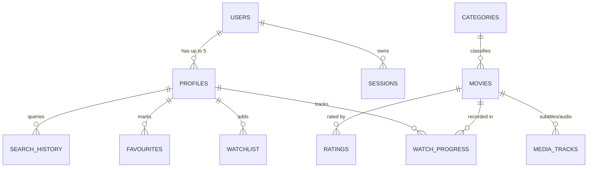

# 🎬 CINEVORA — Enterprise Full-Stack Movie Streaming & Discovery Platform

> **Cinevora** là nền tảng quản lý và phát trực tuyến phim chuẩn doanh nghiệp (Enterprise-Grade Movie Streaming & Discovery Platform). Dự án đánh dấu bước chuyển đổi kiến trúc toàn diện từ ứng dụng CLI Java thuần (với thuật toán tự cài đặt) sang hệ thống phân tán Full-Stack hiện đại: **Spring Boot 3.5.16 / Java 21 LTS**, **PostgreSQL 16 + Flyway V10**, **React 18 + Vite + TypeScript**, kiến trúc bảo mật **Dual-Token HttpOnly**, **Docker Compose** và quy trình tự động hóa **GitHub Actions CI/CD**.

---

<div align="center">

[](https://github.com/thach09/cinevora/actions/workflows/backend-ci.yml)
[](https://github.com/thach09/cinevora/actions/workflows/frontend-ci.yml)
[](https://github.com/thach09/cinevora/actions/workflows/integration-ci.yml)
[](https://github.com/thach09/cinevora/actions/workflows/security-ci.yml)

[](https://www.oracle.com/java/)
[](https://spring.io/projects/spring-boot)
[](https://www.postgresql.org/)
[](https://react.dev/)
[](https://www.typescriptlang.org/)
[](https://vitejs.dev/)
[](https://tailwindcss.com/)
[](https://www.docker.com/)
[](LICENSE)

</div>

---

## 📌 Bảng điều khiển bàn giao & Kiểm định (Quality & Release Status)

Dự án đã trải qua đợt thẩm định độc lập (**Independent QA & Security Audit**) và khắc phục toàn diện (**Final Remediation**). Toàn bộ 6 phát hiện bảo mật/đồng thời (`FQA-001` đến `FQA-006`) đã được verify thành công ở mức mã nguồn và môi trường kiểm thử runtime local.

| Hạng mục kiểm định | Trạng thái kỹ thuật | Minh chứng / Bằng chứng thực thi |
|:---|:---:|:---|
| **Local Release Candidate** | **VERIFIED (PASS)** | Sẵn sàng bàn giao, full-stack docker compose chạy trơn tru |
| **Database Migrations** | **PASS (V1–V10)** | 10 script Flyway thực thi sạch sẽ trên PostgreSQL 16 Alpine |
| **Backend Test Suite** | **PASS (36/36 normal + 11/11 gated)** | 100% test vượt qua không lỗi (Security, Concurrency, Runtime) |
| **Frontend & E2E Testing** | **PASS (7/7 Core + 1/1 Topology)** | Playwright browser suite pass toàn bộ luồng Auth, CMS, Streaming |
| **Security Auditing** | **HARDENED** | Trivy: 0 CVE, npm audit: 0 vuln, Gitleaks: 0 leak, ZAP baseline verified |
| **Concurrency Guarantees** | **VERIFIED** | Pessimistic locking cho giới hạn 5 profile; JPQL Atomic counter updates |
| **Public Production Deployment** | **READY TO CONFIGURE** | Yêu cầu domain HTTPS same-site theo đúng `DEPLOYMENT_RUNBOOK.md` |

> [!NOTE]
> Báo cáo chi tiết quá trình kiểm thử độc lập và remediation được lưu trữ tại [FINAL_REMEDIATION_REPORT.md](docs/verification/FINAL_REMEDIATION_REPORT.md) và [FINAL_INDEPENDENT_QA_SECURITY_AUDIT.md](docs/verification/FINAL_INDEPENDENT_QA_SECURITY_AUDIT.md).

---

## 📖 Mục lục

1. [Tổng quan dự án & Lịch sử tiến hóa](#-tổng-quan-dự-án--lịch-sử-tiến-hóa)
2. [Kiến trúc hệ thống (System Architecture)](#-kiến-trúc-hệ-thống-system-architecture)
3. [Ngăn xếp công nghệ (Technology Stack)](#-ngăn-xếp-công-nghệ-technology-stack)
4. [Tính năng hệ thống (Feature Matrix)](#-tính-năng-hệ-thống-feature-matrix)
5. [Thiết kế cơ sở dữ liệu & Migrations](#-thiết-kế-cơ-sở-dữ-liệu--migrations)
6. [Tiêu chuẩn bảo mật & Cơ chế đồng thời](#-tiêu-chuẩn-bảo-mật--cơ-chế-đồng-thời)
7. [Hướng dẫn cài đặt & Khởi chạy (Quick Start)](#-hướng-dẫn-cài-đặt--khởi-chạy-quick-start)
8. [Tài liệu API & Chuẩn giao tiếp (API Specification)](#-tài-liệu-api--chuẩn-giao-tiếp-api-specification)
9. [Cấu trúc thư mục dự án (Repository Tree)](#-cấu-trúc-thư-mục-dự-án-repository-tree)
10. [Hướng dẫn triển khai Production (Production Runbook)](#-hướng-dẫn-triển-khai-production-production-runbook)
11. [Thông tin tác giả & Bản quyền](#-thông-tin-tác-giả--bản-quyền)

---

## 🚀 Tổng quan dự án & Lịch sử tiến hóa

### Từ CLI thuần OOP đến Nền tảng Streaming Hiện đại
Cinevora khởi đầu là một ứng dụng dòng lệnh (CLI Console) viết bằng **Java thuần (Standard SDK)** không dùng bất kỳ framework nào. Ứng dụng gốc cài đặt thủ công các thuật toán kinh điển (**Bubble Sort**, **Linear Search**, **Custom Stack** cho tính năng Undo/Redo Watchlist) và lưu trữ dữ liệu dạng File I/O phân tách bằng ký tự `|`.

Nhận diện được các giới hạn về mở rộng, toàn vẹn dữ liệu và an toàn thông tin (như việc lưu mật khẩu không an toàn ở bản demo cũ), toàn bộ hệ thống đã được **tái cấu trúc thành Web Application chuẩn doanh nghiệp**:
- **Bảo toàn quy tắc nghiệp vụ**: Toàn bộ domain logic cốt lõi từ `legacy-cli/src/controller/` được kế thừa và đóng gói thành các `*Service` chuẩn mực trong Spring Boot, kết hợp Spring Data JPA.
- **Hiện đại hóa dữ liệu**: Thay thế hoàn toàn file text bằng cơ sở dữ liệu quan hệ PostgreSQL 16 với 10 bản migration Flyway tuần tự và ID dạng `BIGINT GENERATED BY DEFAULT AS IDENTITY`.
- **Nâng cấp bảo mật triệt để**: Toàn bộ mật khẩu được băm bằng BCrypt (cost 10, độ dài 60 ký tự); triển khai kiến trúc Dual-Token authentication với HttpOnly SameSite Cookie; bổ sung cơ chế khóa đồng thời chống race condition.
- **Thư mục `legacy-cli/`**: Được lưu giữ nguyên vẹn trong repository như một bảo tàng kiến trúc và minh chứng cho năng lực làm chủ lập trình hướng đối tượng (OOP) từ nền tảng.

---

## 🏗 Kiến trúc hệ thống (System Architecture)

Hệ thống được thiết kế theo mô hình **Phân tầng hướng dịch vụ (Multi-Tier Layered Architecture)** với ranh giới trách nhiệm rõ ràng:

```
┌──────────────────────────────────────────────────────────────────────────┐
│                           CLIENT / PRESENTATION                          │
│     React 18.3 (TypeScript) + Vite 6 + TailwindCSS + Zustand Store       │
│     TanStack Query v5 (Data Fetching / Cache) · React Router 7.18        │
└────────────────────────────────────┬─────────────────────────────────────┘
                                     │ HTTPS / REST API (/api/v1)
                                     │ Dual-Token (Bearer + HttpOnly Cookie)
┌────────────────────────────────────▼─────────────────────────────────────┐
│                          SECURITY & GATEWAY TIER                         │
│     Spring Security 6 · Strict CORS (Env-driven) · CSRF Protection       │
│     Rate Limiting Filter · Global Exception Handler (RFC 7807/Envelope) │
├──────────────────────────────────────────────────────────────────────────┤
│                          BUSINESS SERVICE LAYER                          │
│     AuthService · MovieService · CategoryService · UserDataService       │
│     ProfileService (Pessimistic Lock) · MediaStorageService (Local / S3) │
│     Auto-Ranking Engine · RFC 4180 CSV Exporter · NotificationService    │
├──────────────────────────────────────────────────────────────────────────┤
│                           DATA PERSISTENCE TIER                          │
│     Spring Data JPA · Hibernate ORM · Flyway Migration Engine (V1–V10)   │
└──────────────────┬───────────────────────────────────────┬───────────────┘
                   │                                       │
┌──────────────────▼───────────────────┐ ┌─────────────────▼───────────────┐
│           PRIMARY DATABASE           │ │         OBJECT STORAGE          │
│       PostgreSQL 16 (Alpine)         │ │   AWS S3 / Cloudflare R2 / Disk │
│   ACID Transactions · Indexes · FKs  │ │    Posters (WebP/JPEG/PNG)      │
└──────────────────────────────────────┘ └─────────────────────────────────┘
```

### Các nguyên lý & Mẫu thiết kế chủ đạo (Core Design Patterns)
1. **Dependency Injection & Inversion of Control**: Quản lý vòng đời linh hoạt qua Spring IoC Container, loại bỏ phụ thuộc vòng (circular dependency) thông qua tầng Service chuẩn mực.
2. **DTO & Envelope Pattern**: Toàn bộ phản hồi API được chuẩn hóa qua `ApiResponse<T>` (cho cả kết quả thành công và lỗi) và `PageResponse<T>` cho phân trang, cô lập hoàn toàn Entity nội bộ khỏi tầng Web.
3. **Atomic Concurrency Control**:
   - Khóa bi quan (`PESSIMISTIC_WRITE`) trên bản ghi `users` khi thao tác tạo Profile, khống chế cứng số lượng tối đa 5 profile/tài khoản trong môi trường đa luồng.
   - Thao tác đếm lượt xem (`views_count`) và lượt yêu thích (`favourites_count`) được thực thi trực tiếp bằng câu lệnh JPQL cập nhật nguyên tử (Atomic Update), có kiểm tra biên không âm ($\ge 0$).
4. **Adapter Pattern cho Media Storage**: Tự động chuyển đổi giữa lưu trữ Local Disk (`uploads/media`) trong môi trường Dev/Docker sang S3-compatible Storage (AWS S3 hoặc Cloudflare R2) khi chạy Production.

---

## 🛠 Ngăn xếp công nghệ (Technology Stack)

| Lớp kiến trúc | Công nghệ sử dụng | Phiên bản | Vai trò & Mục đích |
|:---|:---|:---:|:---|
| **Backend Runtime** | Java OpenJDK | `21 LTS` | Nền tảng thực thi với hiệu năng cao và Virtual Threads |
| **Web Framework** | Spring Boot | `3.5.16` | Framework ứng dụng doanh nghiệp cốt lõi |
| **Security & Auth** | Spring Security + JJWT | `6.x / 0.12.6` | Xác thực phân quyền RBAC, ký và thẩm định JWT |
| **Database ORM** | Spring Data JPA / Hibernate | `6.x` | Tương tác dữ liệu quan hệ, transaction management |
| **Database Engine** | PostgreSQL (Alpine) | `16` | Cơ sở dữ liệu quan hệ ACID chính thức |
| **Database Migration** | Flyway Core | `10.x` | Quản lý vòng đời và kiểm soát phiên bản schema (V1–V10) |
| **API Documentation** | Springdoc OpenAPI | `2.7.0` | Tự động sinh tài liệu Swagger UI chuẩn OpenAPI 3 |
| **Image Processing** | TwelveMonkeys ImageIO | `3.15.2` | Thẩm định magic bytes và định dạng WebP cho poster |
| **Cloud Storage SDK** | AWS SDK for Java v2 | `2.55.2` | Kết nối lưu trữ đám mây tương thích S3 (AWS / R2) |
| **Frontend Framework**| React | `18.3.1` | Thư viện xây dựng giao diện người dùng SPA |
| **Language** | TypeScript | `5.6.3` | Type safety toàn diện từ giao tiếp API đến UI |
| **Build Tooling** | Vite | `6.4.3` | Bundler và môi trường phát triển front-end siêu tốc |
| **Routing** | React Router DOM | `7.18.4` | Điều hướng Client-side SPA với lazy-loading routes |
| **Server State** | TanStack React Query | `5.59.0` | Quản lý asynchronous state, caching và refetching |
| **Client State** | Zustand | `5.0.0` | Quản lý auth state, profile đang hoạt động |
| **Form & Validation** | React Hook Form + Zod | `7.53 / 3.23` | Validate form tại client với schema runtime an toàn |
| **Styling** | TailwindCSS + PostCSS | `3.4.14` | Hệ thống thiết kế giao diện Dark Mode cao cấp |
| **E2E & UI Testing** | Playwright + Lighthouse | `1.63 / 13.5`| Kiểm thử luồng người dùng trên trình duyệt thật |
| **Containerization** | Docker Compose | `v2+` | Đóng gói môi trường multi-container chuẩn hóa |

---

## 🎯 Tính năng hệ thống (Feature Matrix)

Hệ thống cung cấp đầy đủ các tính năng cho hai nhóm vai trò: **Khách hàng (Customer)** và **Quản trị viên (Admin)**.

### 1. Phân hệ Người dùng & Trải nghiệm xem phim (Customer Portal)
- 🎬 **Trang chủ & Khám phá (Discovery)**: Hero Carousel phim nổi bật, bảng xếp hạng tự động (**Auto Ranking** tính theo điểm kết hợp Rating, Views và Favourites), danh mục thịnh hành (Trending Categories).
- 🔍 **Tìm kiếm & Bộ lọc nâng cao (Search & Filter)**: Tìm kiếm tức thời đa tiêu chí (tên phim, diễn viên, đạo diễn, năm phát hành, thể loại), lưu trữ lịch sử tìm kiếm cá nhân.
- 📺 **Trình phát Video & Chi tiết phim**: Hỗ trợ xem video chuẩn HTML5, phát Trailer YouTube tích hợp, lựa chọn phụ đề/audio tracks đa ngôn ngữ.
- ⏱️ **Tiếp tục xem (Continue Watching)**: Tự động ghi nhận tiến độ xem phim (`watch_progress`), cho phép xem tiếp đúng mốc thời gian từ thiết bị khác.
- 📚 **Thư viện cá nhân (Personal Library)**:
  - **Watchlist**: Danh sách lưu chờ xem.
  - **Favourites**: Bộ sưu tập phim yêu thích.
  - **Watch History**: Lịch sử xem phim chi tiết kèm tính năng **Xuất báo cáo CSV chuẩn RFC 4180** (tự động escape công thức và ký tự đặc biệt).
- 👥 **Quản lý đa hồ sơ (Multi-Profile Support)**: Cho phép tạo tối đa **5 hồ sơ (profiles)** riêng biệt trên cùng 1 tài khoản, hoàn toàn độc lập về lịch sử xem, danh sách yêu thích và cài đặt cá nhân.
- ⚙️ **Quản lý tài khoản (Account & Security)**: Đổi mật khẩu, xem các phiên đăng nhập đang hoạt động, quy trình xác thực email và khôi phục mật khẩu an toàn.

### 2. Phân hệ Quản trị nội dung (Admin CMS Console)
- 📊 **Dashboard Thống kê (Platform Analytics)**: Biểu đồ và chỉ số tổng quan: tổng số phim, lượt xem tích lũy, điểm đánh giá trung bình, phân bổ thể loại.
- 🎞️ **Quản lý Danh mục Phim (Movie Catalog Lifecycle)**: Thêm mới, chỉnh sửa thông tin chi tiết (thời lượng, năm, độ tuổi, đạo diễn, dàn diễn viên), quản lý nguồn stream và video trailer.
- 🖼️ **Quản lý Media & Poster Tải lên**: Tải poster phim trực tiếp với cơ chế kiểm tra định dạng magic bytes (chống file giả mạo), giới hạn dung lượng 5MB, tự động lưu trữ trên Disk hoặc Cloud Storage.
- 🏷️ **Quản lý Thể loại (Category Management)**: Thêm/sửa danh mục với cơ chế **Referential Integrity Guard** (chặn xoá danh mục nếu vẫn còn phim đang kích hoạt liên kết).
- 📦 **Trung tâm Lưu trữ & Khôi phục (Soft-Delete Archive)**: Khôi phục tức thời các bộ phim hoặc danh mục đã bị vô hiệu hóa (`is_active = false`), bảo toàn dữ liệu lịch sử.
- 👤 **Quản lý Người dùng (User Administration)**: Phân quyền vai trò (Admin / Customer), quản lý trạng thái tài khoản.

---

## 🗄 Thiết kế cơ sở dữ liệu & Migrations

Cinevora sử dụng **PostgreSQL 16** với 10 tập lệnh migration tuần tự thông qua Flyway, đảm bảo tính nhất quán và khả năng phục hồi dữ liệu:



### Danh mục các bản Migration Flyway (V1–V10)

| Phiên bản | Tên tập tin script | Trọng tâm thay đổi & Nhiệm vụ nghiệp vụ |
|:---|:---|:---|
| **V1** | `V1__init_schema.sql` | Khởi tạo bảng gốc: `users`, `categories`, `movies`, `watch_progress`, `watchlist`, `favourites`, `movie_ratings`. Ràng buộc khoá ngoại và trigger cập nhật timestamp. |
| **V2** | `V2__seed_data.sql` | Nạp dữ liệu khởi tạo: 7 thể loại chuẩn, 60 phim Việt Nam & Quốc tế kèm thông số views/ratings, tài khoản demo với mật khẩu băm BCrypt. |
| **V3** | `V3__media_and_playback.sql` | Bổ sung các trường lưu trữ media, đường dẫn video playback và cấu hình nguồn phát trực tuyến. |
| **V4** | `V4__account_sessions_and_security.sql` | Tạo bảng quản lý phiên làm việc (`sessions`), lưu trữ refresh token có băm, cơ chế epoch bảo mật tài khoản. |
| **V5** | `V5__profiles_and_personal_data_ownership.sql` | Triển khai mô hình Multi-Profile: chuyển quyền sở hữu watchlist, favourites, watch progress từ tài khoản sang từng profile cụ thể. |
| **V6** | `V6__preferences_and_search_history.sql` | Bổ sung bảng lưu lịch sử tìm kiếm và tùy chọn cá nhân hóa người dùng. |
| **V7** | `V7__tracks_and_notifications.sql` | Hỗ trợ phụ đề/audio tracks đa ngôn ngữ (`media_tracks`) và hệ thống thông báo (`notifications`). |
| **V8** | `V8__performance_indexes.sql` | Tạo chỉ mục tối ưu hóa tốc độ truy vấn tìm kiếm, auto-ranking và kiểm tra khóa ngoại đồng thời. |
| **V9** | `V9__movie_trailer_source.sql` | Bổ sung trường nguồn trailer YouTube chính thức cho toàn bộ danh mục phim. |
| **V10** | `V10__security_state.sql` | Thiết lập bảng trạng thái phục vụ quy trình Bootstrap Admin một lần trên môi trường production. |

---

## 🔒 Tiêu chuẩn bảo mật & Cơ chế đồng thời (Security & Concurrency)

Dự án được xây dựng và kiểm định dựa trên bộ tiêu chuẩn an toàn ứng dụng web **OWASP ASVS Level 2**:

### 1. Chiến lược Xác thực Dual-Token (Dual-Token Auth Flow)
- **Access Token**: JWT ngắn hạn (15 phút), **chỉ lưu trong bộ nhớ RAM** (Zustand JavaScript runtime), tuyệt đối không lưu vào `localStorage` hay `sessionStorage` để triệt tiêu nguy cơ bị tấn công XSS đánh cắp token.
- **Refresh Token**: Được cấp phát qua Cookie với các cờ bảo vệ tối đa: `HttpOnly; Secure; SameSite=Lax; Path=/api/v1/auth`. Cookie này trình duyệt tự quản lý, mã JavaScript không thể đọc được.
- **Atomic Rotation**: Khi refresh token được sử dụng, nó bị vô hiệu hóa ngay lập tức và cấp mới token khác (Single-Use Token Rotation). Trong kiểm thử đồng thời 25 luồng đua nhau refresh, hệ thống đảm bảo chính xác 1 luồng thành công và 24 luồng bị từ chối 401.

### 2. Kiểm soát Đồng thời & Toàn vẹn Dữ liệu (Concurrency Controls)
- **Profile Creation Guard**: Sử dụng cơ chế khóa mức dòng `PESSIMISTIC_WRITE` trên bảng `users` trong transaction tạo profile. Trong kịch bản 10 request tạo profile gửi đến đồng thời, hệ thống chỉ chấp thuận số lượng cho phép (tối đa 5 profile/account) và từ chối có kiểm soát với mã 400 cho các request vượt ngưỡng.
- **Atomic Counter Invariant**: Lượt xem phim và lượt thêm yêu thích được cập nhật bằng câu lệnh update nguyên tử trong DB, tránh hiện tượng Race Condition gây sai lệch dữ liệu đếm khi có hàng chục người dùng tương tác cùng mili-giây.

### 3. Vệ sinh Đầu vào & Chống Lỗ hổng (Defensive Engineering)
- **Validation 3 tầng**: Jakarta Bean Validation ở tầng Controller $\rightarrow$ Business Domain Invariant ở tầng Service $\rightarrow$ Schema Constraints ở PostgreSQL.
- **File Upload Hardening**:
  - Giới hạn dung lượng tối đa 5MB.
  - Sử dụng thư viện `TwelveMonkeys ImageIO` đọc magic bytes của file để xác định đúng định dạng ảnh (JPEG, PNG, WebP), ngăn chặn triệt để kỹ thuật đổi đuôi file để upload mã độc webshell.
  - Tên file lưu trữ được sinh ngẫu nhiên UUIDv4, loại bỏ hoàn toàn nguy cơ Path Traversal (`../../`).
- **Global Error Sanitization**: Mọi ngoại lệ runtime được bắt tại `GlobalExceptionHandler`, đóng gói vào cấu trúc chuẩn `ApiResponse` và không để lộ stack trace, câu lệnh SQL hay cấu trúc thư mục nội bộ ra bên ngoài.

---

## ⚡ Hướng dẫn cài đặt & Khởi chạy (Quick Start)

### Yêu cầu tiên quyết (Prerequisites)
- [Git](https://git-scm.com/)
- [Docker Desktop](https://www.docker.com/products/docker-desktop/) (khuyến nghị chạy với WSL2 trên Windows)
- *(Tùy chọn nếu chạy thủ công không dùng Docker)*: JDK 21 LTS, Node.js 20+, Maven 3.9+, PostgreSQL 16.

---

### Cách 1: Khởi chạy Full-Stack bằng Docker Compose (Khuyến nghị)

Đây là cách nhanh nhất và chuẩn xác nhất để trải nghiệm toàn bộ hệ thống với cấu hình đã được kiểm định.

```powershell
# 1. Clone repository
git clone https://github.com/thach09/cinevora.git
cd cinevora

# 2. Thiết lập biến môi trường local từ file mẫu
Copy-Item .env.example .env    # Trên Windows PowerShell
# hoặc: cp .env.example .env     # Trên Linux / macOS

# 3. Khởi động toàn bộ cụm container (PostgreSQL, Backend, Frontend)
docker compose up --build -d
```

Sau khi các container hoàn tất khởi động và đạt trạng thái `healthy`:

| Dịch vụ | Địa chỉ truy cập | Ghi chú |
|:---|:---|:---|
| 🌐 **Frontend Web App** | `http://localhost:8088` | Giao diện React SPA đầy đủ tính năng |
| 🔌 **Backend REST API** | `http://localhost:8080` | Endpoint gốc của API dịch vụ |
| 📑 **Swagger API Docs** | `http://localhost:8080/swagger-ui.html` | OpenAPI interactive documentation |
| ❤️ **Health Check** | `http://localhost:8080/actuator/health` | Trả về trạng thái UP của hệ thống |

Để dừng hệ thống nhưng vẫn bảo lưu dữ liệu:
```powershell
docker compose down
```

---

### Cách 2: Khởi chạy môi trường phát triển (Local Development)

Nếu bạn muốn debug trực tiếp mã nguồn Backend hoặc Frontend trên IDE (IntelliJ IDEA / VS Code):

#### Bước 1: Khởi động cơ sở dữ liệu PostgreSQL
```powershell
docker compose up -d postgres
```

#### Bước 2: Chạy Backend Spring Boot
```powershell
cd backend
# Cấu hình file .env hoặc nạp biến môi trường cho IDE:
# SPRING_PROFILES_ACTIVE=dev
# SPRING_DATASOURCE_URL=jdbc:postgresql://localhost:5432/cinevora_db
# SPRING_DATASOURCE_USERNAME=postgres
# SPRING_DATASOURCE_PASSWORD=<mật-khẩu-trong-.env>
# JWT_SECRET=<chuỗi-ngẫu-nhiên-trên-48-bytes>

./mvnw spring-boot:run          # Linux / macOS
# hoặc: .\mvnw.cmd spring-boot:run # Windows
```

#### Bước 3: Chạy Frontend Vite React
```powershell
cd frontend
npm install
npm run dev
```
Giao diện phát triển sẽ mở tại `http://localhost:5173`.

---

### 🔑 Thông tin tài khoản thử nghiệm (Demo Credentials)

> [!IMPORTANT]
> Toàn bộ mật khẩu trong cơ sở dữ liệu seed đã được băm an toàn bằng **BCrypt**. Giá trị mật khẩu đăng nhập cho môi trường local được cấu hình thông qua biến `DEMO_PASSWORD` trong file `.env` cá nhân của bạn.
>
> Khi triển khai lên môi trường Production, cơ chế **Bootstrap Admin** sẽ kích hoạt: hệ thống tự động vô hiệu hóa toàn bộ các tài khoản demo này và chỉ khởi tạo một tài khoản Quản trị viên duy nhất dựa trên biến môi trường bí mật do nhà cung cấp đám mây cấp.

| Tài khoản mẫu | Quyền hạn (Role) | Dữ liệu khởi tạo sẵn |
|:---|:---:|:---|
| `admin` | **ADMIN** | Toàn quyền truy cập Dashboard, CRUD phim, thể loại, quản lý người dùng |
| `thietthach09` | **CUSTOMER** | Đầy đủ dữ liệu mẫu: Watchlist, Favourites, Lịch sử xem phim |
| `messi10` | **CUSTOMER** | Dữ liệu mẫu phim kinh điển, lịch sử xem |
| *8 tài khoản khác* | **CUSTOMER** | Tài khoản trắng sẵn sàng để kiểm thử đăng ký, thêm hồ sơ mới |

---

## 📡 Tài liệu API & Chuẩn giao tiếp (API Specification)

Toàn bộ API được phục vụ dưới tiền tố `/api/v1` và tuân thủ chặt chẽ định dạng phản hồi chuẩn hóa:

### 1. Cấu trúc phản hồi chuẩn (`ApiResponse<T>`)

```json
// Thành công (HTTP 200/201)
{
  "success": true,
  "message": "Operation completed successfully",
  "data": { ... },
  "timestamp": "2026-09-24T10:00:00Z"
}

// Thất bại (HTTP 400/401/403/404/413/415/429/500)
{
  "success": false,
  "message": "Resource not found or validation failed",
  "errorCode": "MOVIE_NOT_FOUND",
  "timestamp": "2026-09-24T10:00:00Z"
}
```

### 2. Các nhóm Endpoint chính

| Nhóm Endpoint | Đường dẫn cơ sở | Mô tả nghiệp vụ |
|:---|:---|:---|
| 🔐 **Authentication** | `/api/v1/auth/*` | Đăng nhập, đăng ký, refresh token qua cookie, đổi/quên mật khẩu, đăng xuất |
| 🎬 **Movies Public** | `/api/v1/movies/*` | Danh sách phim, chi tiết, top ranking, danh mục, tìm kiếm đa tiêu chí |
| 🏷️ **Categories** | `/api/v1/categories/*` | Danh sách thể loại phim đang hoạt động |
| 👤 **User Space** | `/api/v1/users/me/*` | Quản lý profile, thư viện Watchlist, Favourites, Watch History, CSV Export |
| 🛠️ **Admin Movies** | `/api/v1/admin/movies/*` | CRUD danh mục phim, upload poster, gán video trailer |
| 🛠️ **Admin Categories** | `/api/v1/admin/categories/*`| CRUD thể loại, kiểm tra ràng buộc khóa ngoại an toàn |
| 📦 **Admin Archive** | `/api/v1/admin/archive/*` | Danh sách lưu trữ và tính năng 1-click restore phim/thể loại |
| 👥 **Admin Users** | `/api/v1/admin/users/*` | Tra cứu danh sách và kiểm soát trạng thái người dùng |
| 📈 **Admin Stats** | `/api/v1/admin/statistics/*`| Chỉ số đo lường nền tảng phục vụ quản trị |
| 🩺 **System Health** | `/actuator/health` | Kiểm tra trạng thái hoạt động của Service và DB |

---

## 📁 Cấu trúc thư mục dự án (Repository Tree)

```
cinevora/
├── backend/                               # Spring Boot 3.5.16 Application
│   ├── src/main/java/com/cinevora/
│   │   ├── config/                        # Cấu hình Security, CORS, S3/Media, Swagger
│   │   ├── controller/                    # REST Controllers (/api/v1)
│   │   ├── dto/                           # Data Transfer Objects & API Envelopes
│   │   ├── entity/                        # JPA Domain Entities
│   │   ├── exception/                     # Global Exception Handler & Custom Errors
│   │   ├── repository/                    # Spring Data JPA Repositories
│   │   ├── security/                      # JWT Token Provider, Auth Filters, UserDetails
│   │   └── service/                       # Business Logic Layer (Transaction Managed)
│   ├── src/main/resources/
│   │   ├── application.yml                # Cấu hình dùng chung
│   │   ├── application-dev.yml            # Môi trường phát triển cục bộ
│   │   ├── application-prod.yml           # Môi trường Cloud Production an toàn
│   │   └── db/migration/                  # 10 kịch bản Flyway Migrations (V1–V10)
│   ├── src/test/                          # Unit & Integration Test Suites
│   └── pom.xml                            # Quản lý dependencies Maven
├── frontend/                              # React 18 + Vite + TypeScript Application
│   ├── src/
│   │   ├── components/                    # UI Components (Player, Layout, Cards, Modal)
│   │   ├── pages/                         # Màn hình chính (Auth, Browse, Detail, CMS)
│   │   ├── store/                         # Zustand Stores (AuthStore, ProfileStore)
│   │   ├── types/                         # TypeScript Type Definitions
│   │   ├── routes.tsx                     # Định tuyến Client (Protected & Role Routes)
│   │   └── main.tsx                       # Entry Point ứng dụng
│   ├── tests/e2e/                         # Bộ kiểm thử trình duyệt Playwright E2E
│   └── package.json                       # Scripts & Dependencies frontend
├── legacy-cli/                            # Phiên bản gốc Java Core CLI (Bảo tồn OOP mẫu)
│   ├── src/                               # Mã nguồn Pure Java, MVC, Custom Stack/Sort
│   └── run.bat                            # Script chạy bản CLI lịch sử
├── docs/                                  # Tài liệu kỹ thuật chi tiết
│   ├── adr/                               # Architecture Decision Records
│   ├── database/                          # Seed mapping & Migration runbooks
│   ├── deployment/                        # Sổ tay hướng dẫn triển khai Cloud
│   ├── erd/                               # Bản vẽ thiết kế cơ sở dữ liệu quan hệ
│   ├── roadmap/                           # Lộ trình 7 Phase từ thiết kế đến bàn giao
│   ├── security/                          # Ma trận ASVS, Threat Model, DDoS Defense
│   └── verification/                      # Báo cáo Audit độc lập & Remediation thực tế
├── tools/                                 # Công cụ hỗ trợ độc lập bằng JDK thuần
│   ├── PasswordHashGenerator.java         # Tạo hash BCrypt chuẩn
│   └── SeedSqlGenerator.java              # Sinh dữ liệu seed V2
├── .github/workflows/                     # Pipeline CI/CD tự động (5 workflows)
├── docker-compose.yml                     # Cấu hình triển khai container local
├── .env.example                           # Mẫu khai báo biến môi trường chuẩn
├── AGENTS.md                              # Nguyên tắc kỹ thuật & Quy chuẩn repo
└── README.md                              # Tài liệu tổng quan dự án
```

---

## 🌐 Hướng dẫn triển khai Production (Production Runbook)

### 1. Kiến trúc Tên miền Same-Site Bắt buộc (Crucial Topology Requirement)
Do cơ chế bảo mật xác thực sử dụng cookie `Secure; HttpOnly; SameSite=Lax`, **Frontend và Backend API bắt buộc phải nằm trên cùng một Site cấp 2 (Same-Site Domain)** hoặc sử dụng Reverse Proxy cùng origin:

- ✅ **Mô hình hợp lệ (Supported)**:
  - Frontend: `https://cinevora.com` (hoặc `https://app.cinevora.com`)
  - Backend API: `https://api.cinevora.com`
- ❌ **Mô hình không được hỗ trợ (Blocked by Browser Cookie Policy)**:
  - Frontend dùng subdomain miễn phí của Vercel: `https://cinevora.vercel.app`
  - Backend dùng subdomain miễn phí của Render: `https://cinevora-api.onrender.com`
  *(Trình duyệt hiện đại sẽ coi đây là Cross-Site và từ chối gửi Cookie xác thực khi thực hiện request).*

### 2. Danh mục Biến môi trường Bắt buộc cho Production

```ini
# Spring Profile
SPRING_PROFILES_ACTIVE=prod

# Cơ sở dữ liệu PostgreSQL có chứng chỉ SSL
SPRING_DATASOURCE_URL=jdbc:postgresql://<db-host>:5432/<db-name>
DB_USERNAME=<db-user>
DB_PASSWORD=<db-strong-password>
DB_SSL_MODE=require

# Khóa bí mật JWT (sinh ngẫu nhiên >= 48 bytes)
JWT_SECRET=<super-secret-random-bytes-key>

# Giới hạn nguồn gốc CORS (Chính xác domain Frontend)
CORS_ALLOWED_ORIGINS=https://cinevora.com

# Thông tin Bootstrap Admin một lần duy nhất (Không commit vào Git!)
BOOTSTRAP_ADMIN_USERNAME=owner_admin
BOOTSTRAP_ADMIN_EMAIL=admin@cinevora.com
BOOTSTRAP_ADMIN_PASSWORD=<mat-khau-tren-20-ky-tu-cuc-manh>

# Dịch vụ lưu trữ Object Storage (AWS S3 hoặc Cloudflare R2)
MEDIA_STORAGE=s3
MEDIA_S3_ENDPOINT=https://<account-id>.r2.cloudflarestorage.com
MEDIA_S3_REGION=auto
MEDIA_S3_BUCKET=cinevora-media
MEDIA_PUBLIC_BASE_URL=https://media.cinevora.com
MEDIA_S3_ACCESS_KEY=<access-key>
MEDIA_S3_SECRET_KEY=<secret-key>
```

> Chi tiết các bước triển khai chi tiết từng dịch vụ đám mây (Render, Railway, Vercel, Cloudflare R2) được hướng dẫn từng bước trong [DEPLOYMENT_RUNBOOK.md](docs/deployment/DEPLOYMENT_RUNBOOK.md).

---

## 👤 Thông tin tác giả & Bản quyền

Dự án được xây dựng và phát triển bởi:

**Đỗ Thiết Thạch**  
*Full-Stack Software Engineer — FPT University*  
- **GitHub**: [@thach09](https://github.com/thach09)  
- **Repository**: [thach09/cinevora](https://github.com/thach09/cinevora)

### Bản quyền (License)
Dự án được phân phối dưới giấy phép **MIT License**. Bạn được tự do sử dụng, chỉnh sửa và phân phối lại cho các mục đích nghiên cứu và thương mại. Xem chi tiết tại [LICENSE](LICENSE).

---

<div align="center">

**⭐ Nếu bạn thấy dự án này chuyên nghiệp và hữu ích, hãy để lại một Star trên GitHub để ủng hộ tác giả! ⭐**

*Cinevora — Professional Portfolio Project demonstrating end-to-end Senior Engineering Standards.*

</div>
