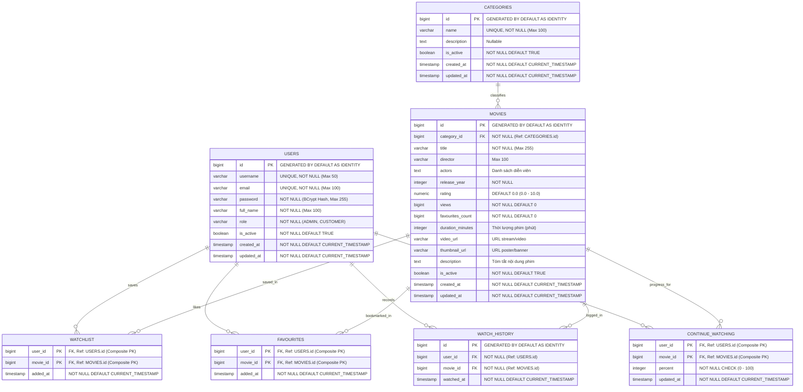

# CINEVORA — Sơ Đồ Thực Thể Quan Hệ (Database ERD)

Tài liệu này định nghĩa chi tiết mô hình cơ sở dữ liệu quan hệ (PostgreSQL 16) cho dự án Cinevora, được ánh xạ và chuẩn hóa 3NF từ toàn bộ nghiệp vụ Core OOP của phiên bản CLI theo đúng định hướng tại [Phase 1 Database Roadmap](../roadmap/01_PHASE_1_DATABASE.md).

---

## 1. Sơ Đồ Thực Thể Quan Hệ (Mermaid ERD)



---

## 2. Từ Điển Dữ Liệu (Data Dictionary)

Hệ thống bao gồm **7 bảng dữ liệu** được thiết kế chặt chẽ theo chuẩn 3NF và quy ước của Spring Data JPA:

### 2.1. Bảng `users`
Lưu trữ toàn bộ tài khoản người dùng, gộp chung `Admin` và `Customer` theo mô hình **Single Table Inheritance** (`@Inheritance(strategy = InheritanceType.SINGLE_TABLE)`):

| Tên Cột | Kiểu Dữ Liệu | Ràng Buộc | Ý Nghĩa Nghiệp Vụ |
|---|---|---|---|
| `id` | `BIGINT` | `PK`, `GENERATED BY DEFAULT AS IDENTITY` | Khóa chính tự tăng |
| `username` | `VARCHAR(50)` | `NOT NULL`, `UNIQUE` | Tên đăng nhập (dùng xác thực) |
| `email` | `VARCHAR(100)` | `NOT NULL`, `UNIQUE` | Địa chỉ email liên hệ |
| `password` | `VARCHAR(255)` | `NOT NULL` | Mật khẩu băm (BCrypt hash) |
| `full_name` | `VARCHAR(100)` | `NOT NULL` | Họ và tên hiển thị |
| `role` | `VARCHAR(20)` | `NOT NULL`, `CHECK (role IN ('ADMIN', 'CUSTOMER'))` | Phân quyền vai trò |
| `is_active` | `BOOLEAN` | `NOT NULL DEFAULT TRUE` | Trạng thái kích hoạt (xóa mềm) |
| `created_at` | `TIMESTAMP WITH TIME ZONE` | `NOT NULL DEFAULT CURRENT_TIMESTAMP` | Thời điểm tạo tài khoản |
| `updated_at` | `TIMESTAMP WITH TIME ZONE` | `NOT NULL DEFAULT CURRENT_TIMESTAMP` | Thời điểm cập nhật cuối |

---

### 2.2. Bảng `categories`
Quản lý thể loại phim do Admin cấu hình:

| Tên Cột | Kiểu Dữ Liệu | Ràng Buộc | Ý Nghĩa Nghiệp Vụ |
|---|---|---|---|
| `id` | `BIGINT` | `PK`, `GENERATED BY DEFAULT AS IDENTITY` | Khóa chính tự tăng |
| `name` | `VARCHAR(100)` | `NOT NULL`, `UNIQUE` | Tên thể loại (Hành động, Tình cảm,...) |
| `description` | `TEXT` | `NULL` | Mô tả chi tiết thể loại |
| `is_active` | `BOOLEAN` | `NOT NULL DEFAULT TRUE` | Trạng thái hoạt động (xóa mềm/restore) |
| `created_at` | `TIMESTAMP WITH TIME ZONE` | `NOT NULL DEFAULT CURRENT_TIMESTAMP` | Thời điểm tạo |
| `updated_at` | `TIMESTAMP WITH TIME ZONE` | `NOT NULL DEFAULT CURRENT_TIMESTAMP` | Thời điểm cập nhật cuối |

---

### 2.3. Bảng `movies`
Thông tin chi tiết các bộ phim. Mỗi bộ phim thuộc về 1 thể loại chính (`category_id`):

| Tên Cột | Kiểu Dữ Liệu | Ràng Buộc | Ý Nghĩa Nghiệp Vụ |
|---|---|---|---|
| `id` | `BIGINT` | `PK`, `GENERATED BY DEFAULT AS IDENTITY` | Khóa chính tự tăng |
| `category_id` | `BIGINT` | `NOT NULL`, `FK -> categories(id)` | Khóa ngoại trỏ đến thể loại |
| `title` | `VARCHAR(255)` | `NOT NULL` | Tựa đề phim |
| `director` | `VARCHAR(100)` | `NULL` | Đạo diễn |
| `actors` | `TEXT` | `NULL` | Danh sách diễn viên tham gia |
| `release_year` | `INTEGER` | `NOT NULL`, `CHECK (release_year >= 1888)` | Năm phát hành |
| `rating` | `NUMERIC(3,1)` | `DEFAULT 0.0`, `CHECK (rating >= 0.0 AND rating <= 10.0)` | Điểm đánh giá trung bình |
| `views` | `BIGINT` | `NOT NULL DEFAULT 0` | Tổng lượt xem |
| `favourites_count` | `BIGINT` | `NOT NULL DEFAULT 0` | Số lượt người dùng yêu thích |
| `duration_minutes` | `INTEGER` | `NULL`, `CHECK (duration_minutes > 0)` | Thời lượng phim (phút) |
| `video_url` | `VARCHAR(500)` | `NULL` | Đường dẫn stream video |
| `thumbnail_url` | `VARCHAR(500)` | `NULL` | Ảnh poster/banner đại diện |
| `description` | `TEXT` | `NULL` | Tóm tắt cốt truyện |
| `is_active` | `BOOLEAN` | `NOT NULL DEFAULT TRUE` | Trạng thái phát hành |
| `created_at` | `TIMESTAMP WITH TIME ZONE` | `NOT NULL DEFAULT CURRENT_TIMESTAMP` | Thời điểm thêm phim |
| `updated_at` | `TIMESTAMP WITH TIME ZONE` | `NOT NULL DEFAULT CURRENT_TIMESTAMP` | Thời điểm cập nhật cuối |

---

### 2.4. Bảng `watchlist`
Bảng trung gian quản lý danh sách xem sau của người dùng (quan hệ N-N giữa `users` và `movies`):

| Tên Cột | Kiểu Dữ Liệu | Ràng Buộc | Ý Nghĩa Nghiệp Vụ |
|---|---|---|---|
| `user_id` | `BIGINT` | `PK`, `FK -> users(id) ON DELETE CASCADE` | Mã người dùng |
| `movie_id` | `BIGINT` | `PK`, `FK -> movies(id) ON DELETE CASCADE` | Mã phim |
| `added_at` | `TIMESTAMP WITH TIME ZONE` | `NOT NULL DEFAULT CURRENT_TIMESTAMP` | Thời điểm thêm vào watchlist |

> Khóa chính phức hợp (Composite PK): `(user_id, movie_id)`.

---

### 2.5. Bảng `favourites`
Bảng trung gian lưu danh sách phim yêu thích của người dùng:

| Tên Cột | Kiểu Dữ Liệu | Ràng Buộc | Ý Nghĩa Nghiệp Vụ |
|---|---|---|---|
| `user_id` | `BIGINT` | `PK`, `FK -> users(id) ON DELETE CASCADE` | Mã người dùng |
| `movie_id` | `BIGINT` | `PK`, `FK -> movies(id) ON DELETE CASCADE` | Mã phim |
| `added_at` | `TIMESTAMP WITH TIME ZONE` | `NOT NULL DEFAULT CURRENT_TIMESTAMP` | Thời điểm bấm yêu thích |

> Khóa chính phức hợp (Composite PK): `(user_id, movie_id)`.

---

### 2.6. Bảng `watch_history`
Ghi lại nhật ký xem phim của người dùng. Một người dùng có thể xem lại một bộ phim nhiều lần tại các mốc thời gian khác nhau, vì vậy bảng sử dụng khóa chính tự tăng `id`:

| Tên Cột | Kiểu Dữ Liệu | Ràng Buộc | Ý Nghĩa Nghiệp Vụ |
|---|---|---|---|
| `id` | `BIGINT` | `PK`, `GENERATED BY DEFAULT AS IDENTITY` | Khóa chính tự tăng |
| `user_id` | `BIGINT` | `NOT NULL`, `FK -> users(id) ON DELETE CASCADE` | Người dùng đã xem |
| `movie_id` | `BIGINT` | `NOT NULL`, `FK -> movies(id) ON DELETE CASCADE` | Phim đã xem |
| `watched_at` | `TIMESTAMP WITH TIME ZONE` | `NOT NULL DEFAULT CURRENT_TIMESTAMP` | Thời điểm ghi nhận lượt xem |

---

### 2.7. Bảng `continue_watching`
Lưu vết tiến trình xem dở của người dùng (từ model `WatchProgress` của bản CLI). Mỗi user với mỗi phim chỉ có đúng 1 tiến trình xem dở duy nhất:

| Tên Cột | Kiểu Dữ Liệu | Ràng Buộc | Ý Nghĩa Nghiệp Vụ |
|---|---|---|---|
| `user_id` | `BIGINT` | `PK`, `FK -> users(id) ON DELETE CASCADE` | Mã người dùng |
| `movie_id` | `BIGINT` | `PK`, `FK -> movies(id) ON DELETE CASCADE` | Mã phim |
| `percent` | `INTEGER` | `NOT NULL`, `CHECK (percent >= 0 AND percent <= 100)` | Tiến độ xem (0% đến 100%) |
| `updated_at` | `TIMESTAMP WITH TIME ZONE` | `NOT NULL DEFAULT CURRENT_TIMESTAMP` | Thời điểm cập nhật tiến trình |

> Khóa chính phức hợp (Composite PK): `(user_id, movie_id)`.

---

## 3. Các Quyết Định Thiết Kế Quan Trọng (Design Decisions)

1. **Single Table Inheritance cho Người Dùng:**
   - Phiên bản CLI có `User` (abstract), `Admin` và `Customer`.
   - Chuyển thành 1 bảng `users` duy nhất với cột `role` ('ADMIN', 'CUSTOMER'). Cách tiếp cận này tối ưu hóa tốc độ xác thực JWT và bảo trì cấu trúc truy vấn đơn giản trong Spring Security.

2. **Xử Lý Thống Kê (Statistics):**
   - Không lưu trữ bảng thống kê tĩnh trong database để tránh xung đột dữ liệu (data inconsistency).
   - Mọi số liệu như: *Top phim xem nhiều nhất*, *Thể loại được ưa chuộng nhất*, *Thống kê doanh thu/lượt xem theo tháng* đều được tính toán theo thời gian thực (realtime) bằng các câu lệnh Aggregate SQL (`COUNT`, `SUM`, `AVG`, `GROUP BY`).

3. **Toàn Vẹn Dữ Liệu & Ràng Buộc Khóa Ngoại:**
   - Khi xóa mềm (Soft Delete) bằng cờ `is_active = false`, dữ liệu lịch sử và quan hệ giữa Category và Movie vẫn được bảo toàn nguyên vẹn.
   - Khi xóa cứng (Hard Delete) User hoặc Movie (nếu có), các bảng con trung gian (`watchlist`, `favourites`, `watch_history`, `continue_watching`) sẽ tự động cascade xóa nhờ ràng buộc `ON DELETE CASCADE`.

---

## 4. Danh Sách Index Khuyến Nghị (Indexing Strategy)

Để tối ưu hóa tốc độ truy vấn khi dữ liệu tăng trưởng:

```sql
-- 1. Index hỗ trợ tìm kiếm và lọc phim
CREATE INDEX idx_movies_category_id ON movies(category_id);
CREATE INDEX idx_movies_release_year ON movies(release_year);
CREATE INDEX idx_movies_rating ON movies(rating DESC);
CREATE INDEX idx_movies_views ON movies(views DESC);

-- 2. Index hỗ trợ truy vấn Watch History theo người dùng
CREATE INDEX idx_watch_history_user_id ON watch_history(user_id, watched_at DESC);

-- 3. Index hỗ trợ tìm kiếm người dùng qua username/email
CREATE INDEX idx_users_username ON users(username);
CREATE INDEX idx_users_email ON users(email);
```
