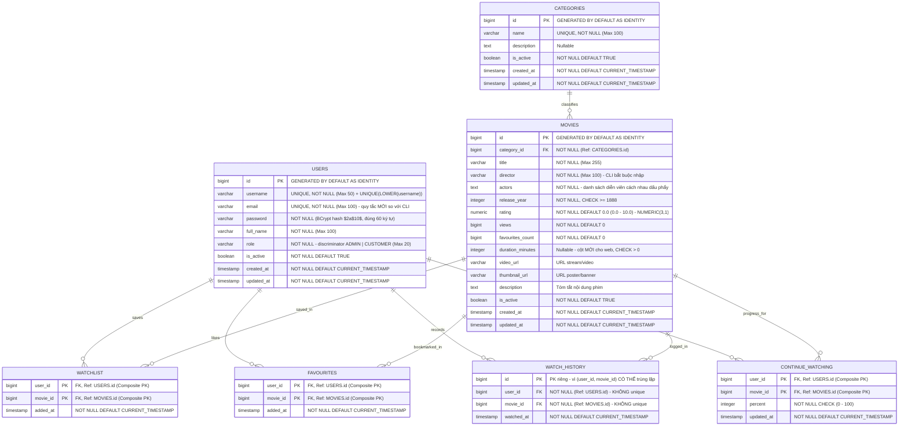

# CINEVORA — Sơ Đồ Thực Thể Quan Hệ (Database ERD)

Tài liệu này định nghĩa chi tiết mô hình cơ sở dữ liệu quan hệ (PostgreSQL 16) cho dự án Cinevora, được ánh xạ và chuẩn hóa 3NF từ toàn bộ nghiệp vụ Core OOP của phiên bản CLI theo đúng định hướng tại [Phase 1 Database Roadmap](../roadmap/01_PHASE_1_DATABASE.md).

---

## 1. Sơ Đồ Thực Thể Quan Hệ (Mermaid ERD)



---

## 2. Từ Điển Dữ Liệu (Data Dictionary)

Hệ thống bao gồm **7 bảng dữ liệu** được thiết kế chặt chẽ theo chuẩn 3NF và quy ước của Spring Data JPA:

### 2.1. Bảng `users`
Lưu trữ toàn bộ tài khoản người dùng, gộp chung `Admin` và `Customer` theo mô hình **Single Table Inheritance** (`@Inheritance(strategy = InheritanceType.SINGLE_TABLE)`):

| Tên Cột | Kiểu Dữ Liệu | Ràng Buộc | Ý Nghĩa Nghiệp Vụ |
|---|---|---|---|
| `id` | `BIGINT` | `PK`, `GENERATED BY DEFAULT AS IDENTITY` | Khóa chính tự tăng |
| `username` | `VARCHAR(50)` | `NOT NULL`, `UNIQUE` + `UNIQUE (LOWER(username))` | Tên đăng nhập (dùng xác thực). CLI so sánh bằng `equalsIgnoreCase`, nên cần thêm index duy nhất trên `LOWER(username)` để chặn trùng lặp không phân biệt hoa/thường ở tầng database |
| `email` | `VARCHAR(100)` | `NOT NULL`, `UNIQUE` | Địa chỉ email liên hệ. **Quy tắc MỚI** — CLI cũ không có ràng buộc này (nếu dữ liệu cũ có email trùng, migration sẽ thất bại) |
| `password` | `VARCHAR(255)` | `NOT NULL` | BCrypt hash `$2a$10$…`, **đúng 60 ký tự**. CLI cũ lưu **plaintext** — xem [seed-mapping.md](../database/seed-mapping.md) §6 |
| `full_name` | `VARCHAR(100)` | `NOT NULL` | Họ và tên hiển thị |
| `role` | `VARCHAR(20)` | `NOT NULL`, `CHECK (role IN ('ADMIN', 'CUSTOMER'))` | Phân quyền vai trò |
| `is_active` | `BOOLEAN` | `NOT NULL DEFAULT TRUE` | Trạng thái kích hoạt (xóa mềm) |
| `created_at` | `TIMESTAMP WITH TIME ZONE` | `NOT NULL DEFAULT CURRENT_TIMESTAMP` | Thời điểm tạo tài khoản |
| `updated_at` | `TIMESTAMP WITH TIME ZONE` | `NOT NULL DEFAULT CURRENT_TIMESTAMP` | Thời điểm cập nhật cuối |

---

### 2.2. Bảng `categories`
Quản lý thể loại phim do Admin cấu hình:

| Tên Cột | Kiểu Dữ Liệu | Ràng Buộc | Ý Nghĩa Nghiệp Vụ |
|---|---|---|---|
| `id` | `BIGINT` | `PK`, `GENERATED BY DEFAULT AS IDENTITY` | Khóa chính tự tăng |
| `name` | `VARCHAR(100)` | `NOT NULL`, `UNIQUE` | Tên thể loại (Hành động, Tình cảm,...) |
| `description` | `TEXT` | `NULL` | Mô tả chi tiết thể loại |
| `is_active` | `BOOLEAN` | `NOT NULL DEFAULT TRUE` | Trạng thái hoạt động (xóa mềm/restore) |
| `created_at` | `TIMESTAMP WITH TIME ZONE` | `NOT NULL DEFAULT CURRENT_TIMESTAMP` | Thời điểm tạo |
| `updated_at` | `TIMESTAMP WITH TIME ZONE` | `NOT NULL DEFAULT CURRENT_TIMESTAMP` | Thời điểm cập nhật cuối |

---

### 2.3. Bảng `movies`
Thông tin chi tiết các bộ phim. Mỗi bộ phim thuộc về 1 thể loại chính (`category_id`):

| Tên Cột | Kiểu Dữ Liệu | Ràng Buộc | Ý Nghĩa Nghiệp Vụ |
|---|---|---|---|
| `id` | `BIGINT` | `PK`, `GENERATED BY DEFAULT AS IDENTITY` | Khóa chính tự tăng |
| `category_id` | `BIGINT` | `NOT NULL`, `FK -> categories(id)` | Khóa ngoại trỏ đến thể loại |
| `title` | `VARCHAR(255)` | `NOT NULL` | Tựa đề phim |
| `director` | `VARCHAR(100)` | `NOT NULL` | Đạo diễn. Legacy `Movie.setDirector()` **bắt buộc** không rỗng → đổi từ `NULL` sang `NOT NULL` |
| `actors` | `TEXT` | `NOT NULL` | Danh sách diễn viên tham gia (cách nhau dấu phẩy). Legacy `setActors()` cũng bắt buộc |
| `release_year` | `INTEGER` | `NOT NULL`, `CHECK (release_year >= 1888)` | Năm phát hành |
| `rating` | `NUMERIC(3,1)` | `NOT NULL DEFAULT 0.0`, `CHECK (rating >= 0.0 AND rating <= 10.0)` | Điểm đánh giá trung bình. ⚠️ Legacy dùng `double` → JPA **phải** map `BigDecimal`, nếu map `Double` thì `ddl-auto=validate` sẽ báo sai kiểu (xem §6) |
| `views` | `BIGINT` | `NOT NULL DEFAULT 0` | **Bộ đếm tích luỹ** tổng lượt xem (`Movie.incrementViews()`), KHÔNG phải `COUNT()` từ `watch_history` |
| `favourites_count` | `BIGINT` | `NOT NULL DEFAULT 0` | **Bộ đếm tích luỹ** số lượt yêu thích, KHÔNG phải `COUNT()` từ bảng `favourites` |
| `duration_minutes` | `INTEGER` | `NULL`, `CHECK (duration_minutes IS NULL OR duration_minutes > 0)` | Thời lượng phim (phút) — cột MỚI cho web |
| `video_url` | `VARCHAR(500)` | `NULL` | Đường dẫn stream video |
| `thumbnail_url` | `VARCHAR(500)` | `NULL` | Ảnh poster/banner đại diện |
| `description` | `TEXT` | `NULL` | Tóm tắt cốt truyện |
| `is_active` | `BOOLEAN` | `NOT NULL DEFAULT TRUE` | Trạng thái phát hành |
| `created_at` | `TIMESTAMP WITH TIME ZONE` | `NOT NULL DEFAULT CURRENT_TIMESTAMP` | Thời điểm thêm phim |
| `updated_at` | `TIMESTAMP WITH TIME ZONE` | `NOT NULL DEFAULT CURRENT_TIMESTAMP` | Thời điểm cập nhật cuối |

---

### 2.4. Bảng `watchlist`
Bảng trung gian quản lý danh sách xem sau của người dùng (quan hệ N-N giữa `users` và `movies`):

| Tên Cột | Kiểu Dữ Liệu | Ràng Buộc | Ý Nghĩa Nghiệp Vụ |
|---|---|---|---|
| `user_id` | `BIGINT` | `PK`, `FK -> users(id) ON DELETE CASCADE` | Mã người dùng |
| `movie_id` | `BIGINT` | `PK`, `FK -> movies(id) ON DELETE CASCADE` | Mã phim |
| `added_at` | `TIMESTAMP WITH TIME ZONE` | `NOT NULL DEFAULT CURRENT_TIMESTAMP` | Thời điểm thêm vào watchlist |

> Khóa chính phức hợp (Composite PK): `(user_id, movie_id)`.

---

### 2.5. Bảng `favourites`
Bảng trung gian lưu danh sách phim yêu thích của người dùng:

| Tên Cột | Kiểu Dữ Liệu | Ràng Buộc | Ý Nghĩa Nghiệp Vụ |
|---|---|---|---|
| `user_id` | `BIGINT` | `PK`, `FK -> users(id) ON DELETE CASCADE` | Mã người dùng |
| `movie_id` | `BIGINT` | `PK`, `FK -> movies(id) ON DELETE CASCADE` | Mã phim |
| `added_at` | `TIMESTAMP WITH TIME ZONE` | `NOT NULL DEFAULT CURRENT_TIMESTAMP` | Thời điểm bấm yêu thích |

> Khóa chính phức hợp (Composite PK): `(user_id, movie_id)`.

---

### 2.6. Bảng `watch_history`
Ghi lại nhật ký xem phim của người dùng. Một người dùng có thể xem lại một bộ phim nhiều lần tại các mốc thời gian khác nhau, vì vậy bảng sử dụng khóa chính tự tăng `id`:

| Tên Cột | Kiểu Dữ Liệu | Ràng Buộc | Ý Nghĩa Nghiệp Vụ |
|---|---|---|---|
| `id` | `BIGINT` | `PK`, `GENERATED BY DEFAULT AS IDENTITY` | Khóa chính tự tăng |
| `user_id` | `BIGINT` | `NOT NULL`, `FK -> users(id) ON DELETE CASCADE` | Người dùng đã xem |
| `movie_id` | `BIGINT` | `NOT NULL`, `FK -> movies(id) ON DELETE CASCADE` | Phim đã xem |
| `watched_at` | `TIMESTAMP WITH TIME ZONE` | `NOT NULL DEFAULT CURRENT_TIMESTAMP` | Thời điểm ghi nhận lượt xem |

> **Vì sao KHÔNG dùng khóa chính ghép `(user_id, movie_id)`?** Vì dữ liệu thật cho phép trùng:
> trong `legacy-cli/data/users.txt`, tài khoản `leo10` có `watchHistory = M46,M01,M01,M43,M26` —
> phim `M01` được xem **2 lần** và phải lưu thành **2 dòng**. Đây là căn cứ dữ liệu (không phải
> suy đoán) cho quyết định thiết kế này.

---

### 2.7. Bảng `continue_watching`
Lưu vết tiến trình xem dở của người dùng (từ model `WatchProgress` của bản CLI). Mỗi user với mỗi phim chỉ có đúng 1 tiến trình xem dở duy nhất:

| Tên Cột | Kiểu Dữ Liệu | Ràng Buộc | Ý Nghĩa Nghiệp Vụ |
|---|---|---|---|
| `user_id` | `BIGINT` | `PK`, `FK -> users(id) ON DELETE CASCADE` | Mã người dùng |
| `movie_id` | `BIGINT` | `PK`, `FK -> movies(id) ON DELETE CASCADE` | Mã phim |
| `percent` | `INTEGER` | `NOT NULL`, `CHECK (percent >= 0 AND percent <= 100)` | Tiến độ xem (0% đến 100%) |
| `updated_at` | `TIMESTAMP WITH TIME ZONE` | `NOT NULL DEFAULT CURRENT_TIMESTAMP` | Thời điểm cập nhật tiến trình |

> Khóa chính phức hợp (Composite PK): `(user_id, movie_id)`.

---

## 3. Các Quyết Định Thiết Kế Quan Trọng (Design Decisions)

1. **Single Table Inheritance cho Người Dùng:**
   - Phiên bản CLI có `User` (abstract), `Admin` và `Customer`.
   - Chuyển thành 1 bảng `users` duy nhất với cột `role` ('ADMIN', 'CUSTOMER'). Cách tiếp cận này tối ưu hóa tốc độ xác thực JWT và bảo trì cấu trúc truy vấn đơn giản trong Spring Security.

2. **Xử Lý Thống Kê (Statistics):**
   - Không lưu trữ bảng thống kê tĩnh trong database để tránh xung đột dữ liệu (data inconsistency).
   - Mọi số liệu như: *Top phim xem nhiều nhất*, *Thể loại được ưa chuộng nhất*, *Thống kê doanh thu/lượt xem theo tháng* đều được tính toán theo thời gian thực (realtime) bằng các câu lệnh Aggregate SQL (`COUNT`, `SUM`, `AVG`, `GROUP BY`).

3. **Toàn Vẹn Dữ Liệu & Ràng Buộc Khóa Ngoại:**
   - Khi xóa mềm (Soft Delete) bằng cờ `is_active = false`, dữ liệu lịch sử và quan hệ giữa Category và Movie vẫn được bảo toàn nguyên vẹn.
   - Khi xóa cứng (Hard Delete) User hoặc Movie (nếu có), các bảng con trung gian (`watchlist`, `favourites`, `watch_history`, `continue_watching`) sẽ tự động cascade xóa nhờ ràng buộc `ON DELETE CASCADE`.

4. **`watch_history` dùng khóa chính riêng `id` (không dùng khóa chính ghép):**
   Một người dùng có thể xem lại cùng một bộ phim nhiều lần. Dữ liệu legacy xác nhận điều này
   (`leo10` có `M01` xuất hiện 2 lần trong `watchHistory`), nên `(user_id, movie_id)` **không thể**
   là duy nhất → bắt buộc phải có `id` tăng tự động. Ngược lại `watchlist`, `favourites` và
   `continue_watching` dùng khóa chính ghép `(user_id, movie_id)` vì mỗi cặp chỉ có đúng 1 dòng.

5. **`views` và `favourites_count` là BỘ ĐẾM TÍCH LUỸ, không phải kết quả aggregate:**
   Ở bản CLI, `Movie.incrementViews()` và `incrementFavourites()` tăng trực tiếp một biến đếm trên
   đối tượng phim. Giá trị này **được giữ nguyên** trong cột ở schema mới, **không** tính lại bằng
   `COUNT(*)` từ `watch_history` / `favourites` — vì hai con số đó **không bằng nhau** (một người
   xem 1 phim 5 lần làm bộ đếm tăng 5, nhưng `watch_history` chỉ có 5 dòng còn `favourites` nhiều
   nhất 1 dòng). Việc dùng `COUNT()` sẽ làm số liệu "Top phim" sai ngay khi có dữ liệu thật.

6. **Index cho cột khóa ngoại là BẮT BUỘC:**
   Khác MySQL, **PostgreSQL không tự tạo index cho cột FK**. Thiếu index ở `watchlist.movie_id`,
   `favourites.movie_id`, `watch_history.movie_id`, `continue_watching.movie_id` khiến mỗi lần xoá
   1 phim phải seq-scan toàn bộ bảng con để kiểm tra `ON DELETE CASCADE`. Xem §4.

7. **Số thể loại là 7 (không phải 6):**
   `legacy-cli/data/categories.txt` có `CAT01`…`CAT07`. Một số tài liệu roadmap ghi "6 thể loại" là
   **sai** — đã sửa lại trong [seed-mapping.md](../database/seed-mapping.md) §4 và `README.md`.

---

## 4. Danh Sách Index Khuyến Nghị (Indexing Strategy)

Để tối ưu hóa tốc độ truy vấn khi dữ liệu tăng trưởng. **Đây là bộ index thật đã được tạo trong
`V1__init_schema.sql`** — không phải đề xuất:

```sql
-- 1. Index cho movies (lọc/tìm kiếm/sắp xếp)
CREATE INDEX idx_movies_category_id  ON movies (category_id);
CREATE INDEX idx_movies_release_year ON movies (release_year);
CREATE INDEX idx_movies_rating       ON movies (rating DESC);
CREATE INDEX idx_movies_views        ON movies (views DESC);

-- 2. Partial index: chỉ quét tập con đang hoạt động (dashboard "top phim đang chiếu")
CREATE INDEX idx_movies_active     ON movies (is_active)     WHERE is_active = TRUE;
CREATE INDEX idx_categories_active ON categories (is_active) WHERE is_active = TRUE;

-- 3. Index cho cột FK phía movies — PostgreSQL KHÔNG tự tạo index cho FK,
--    thiếu index này thì mỗi lần xoá 1 phim phải seq-scan toàn bộ bảng con.
CREATE INDEX idx_watchlist_movie_id         ON watchlist (movie_id);
CREATE INDEX idx_favourites_movie_id        ON favourites (movie_id);
CREATE INDEX idx_watch_history_movie_id     ON watch_history (movie_id);
CREATE INDEX idx_continue_watching_movie_id ON continue_watching (movie_id);

-- 4. Dashboard "Tiếp tục xem" / "Lịch sử gần nhất" của một người dùng
CREATE INDEX idx_watch_history_user_id     ON watch_history (user_id, watched_at DESC);
CREATE INDEX idx_continue_watching_user_id ON continue_watching (user_id, updated_at DESC);

-- 5. Đăng nhập không phân biệt hoa/thường (CLI dùng equalsIgnoreCase)
CREATE UNIQUE INDEX uk_users_username_lower ON users (LOWER(username));
```

### Những gì **KHÔNG** tạo index (và vì sao)

| Index từng được đề xuất | Quyết định | Lý do |
|---|---|---|
| `idx_users_username ON users(username)` | ❌ **Không tạo** | `uk_users_username` (UNIQUE constraint) **đã** tạo index B-tree rồi — tạo thêm chỉ tốn dung lượng và làm chậm ghi |
| `idx_users_email ON users(email)` | ❌ **Không tạo** | Tương tự, `uk_users_email` đã có index |
| `idx ON watchlist(user_id, movie_id)` | ❌ **Không tạo** | Chính là khóa chính `pk_watchlist`, đã có index |
| `idx ON favourites(...)` / `continue_watching(...)` | ❌ **Không tạo** | Tương tự — đã được PK ghép phủ |

> **Nguyên tắc:** index chỉ được tạo khi **chưa** có index nào phủ cùng tiền tố cột. Mọi index dư
> thừa đều phải trả giá bằng dung lượng đĩa và tốc độ `INSERT`/`UPDATE`.

---

## 5. Hành Vi Tham Chiếu & Chiến Lược Seed

### 5.1. Hành Vi Tham Chiếu (Referential Actions)

Bảng đầy đủ, thay cho việc rải rác thông tin ở các mục trên:

| Khóa ngoại | `ON DELETE` | `ON UPDATE` | Lý do |
|---|---|---|---|
| `movies.category_id` → `categories.id` | **`RESTRICT`** | `CASCADE` | Không cho xoá thể loại còn phim — buộc Admin phải xử lý phim trước (tránh mất dữ liệu âm thầm) |
| `watchlist.user_id` → `users.id` | `CASCADE` | `CASCADE` | Xoá user thì xoá theo watchlist của họ |
| `watchlist.movie_id` → `movies.id` | `CASCADE` | `CASCADE` | Xoá phim thì xoá khỏi mọi watchlist |
| `favourites.user_id` → `users.id` | `CASCADE` | `CASCADE` | Tương tự |
| `favourites.movie_id` → `movies.id` | `CASCADE` | `CASCADE` | Tương tự |
| `watch_history.user_id` → `users.id` | `CASCADE` | `CASCADE` | Tương tự |
| `watch_history.movie_id` → `movies.id` | `CASCADE` | `CASCADE` | Tương tự |
| `continue_watching.user_id` → `users.id` | `CASCADE` | `CASCADE` | Tương tự |
| `continue_watching.movie_id` → `movies.id` | `CASCADE` | `CASCADE` | Tương tự |

> ⚠️ **`RESTRICT` là quyết định có chủ ý.** Trong nghiệp vụ, xoá thể loại là thao tác hiếm và nguy
> hiểm; `CASCADE` từ `categories` xuống `movies` sẽ **xoá sạch phim** chỉ vì Admin xoá 1 thể loại.
> `RESTRICT` biến lỗi âm thầm thành lỗi rõ ràng: `ERROR: update or delete on table "categories"
> violates foreign key constraint "fk_movies_categories"`.
>
> Đường đi chuẩn cho "xoá" vẫn là **xoá mềm** (`is_active = FALSE`), giữ nguyên mọi quan hệ —
> đúng như hành vi `setActive(false)` của CLI.

### 5.2. Chiến Lược Seed & Ánh Xạ ID

**Nguồn dữ liệu:** 3 file `legacy-cli/data/*.txt` (7 categories · 60 movies · 11 users) → **104 dòng**
seed trong `V2__seed_data.sql` (7 categories, 60 movies, 11 users, 7 watchlist, 4 favourites,
9 watch_history, 6 continue_watching).

**Quy tắc ánh xạ (xác định, 1-1):**

| Bảng | Khóa cũ | → | Khóa mới |
|---|---|---|---|
| `categories` | `CAT01`…`CAT07` | → | `1`…`7` |
| `movies` | `M01`…`M60` | → | `1`…`60` |
| `users` | `admin123`, `thach09`, … | → | `1`…`11` (theo thứ tự dòng) |

Chi tiết đầy đủ (danh sách từng dòng, mật khẩu demo, quy tắc sinh thời gian): xem
[`seed-mapping.md`](../database/seed-mapping.md).

> [!IMPORTANT]
> **`GENERATED BY DEFAULT AS IDENTITY` + `ALTER … RESTART WITH`.** `V1` cố ý dùng `BY DEFAULT`
> (không phải `ALWAYS`) để `V2` có thể chèn `id` tường minh. Hệ quả bắt buộc: PostgreSQL **không**
> tự tăng sequence khi `id` được chèn thủ công, nên `V2` phải kết thúc bằng 4 câu lệnh:
>
> ```sql
> ALTER TABLE categories    ALTER COLUMN id RESTART WITH 8;
> ALTER TABLE movies        ALTER COLUMN id RESTART WITH 61;
> ALTER TABLE users         ALTER COLUMN id RESTART WITH 12;
> ALTER TABLE watch_history ALTER COLUMN id RESTART WITH 10;
> ```
>
> Nếu thiếu, **ngay INSERT đầu tiên của Phase 2** sẽ thất bại với
> `duplicate key value violates unique constraint "pk_users"`.

---

## 6. Bàn Giao Sang Phase 2 (Spring Boot Handoff)

Phase 1 khoá schema lại; Phase 2 **đọc** schema này chứ không được tự ý đổi. Dưới đây là những chỗ
dễ sai nhất — làm đúng ngay từ đầu để tránh phải sửa cả entity lẫn migration.

### 6.1. Cấu hình bắt buộc

```yaml
spring:
  datasource:
    url: jdbc:postgresql://localhost:5432/cinevora_db
    username: ${SPRING_DATASOURCE_USERNAME:postgres}
    password: ${SPRING_DATASOURCE_PASSWORD:postgres}
  jpa:
    hibernate:
      ddl-auto: validate        # BẮT BUỘC - schema do Flyway quản lý, Hibernate chỉ kiểm tra
    properties:
      hibernate.format_sql: true
  flyway:
    enabled: true
    locations: classpath:db/migration
```

Dependency tối thiểu:

```xml
<dependency>
  <groupId>org.flywaydb</groupId>
  <artifactId>flyway-core</artifactId>
</dependency>
<dependency>
  <!-- BẮT BUỘC từ Flyway 10: nếu thiếu sẽ lỗi "Unsupported Database: PostgreSQL 16" -->
  <groupId>org.flywaydb</groupId>
  <artifactId>flyway-database-postgresql</artifactId>
</dependency>
<dependency>
  <groupId>org.postgresql</groupId>
  <artifactId>postgresql</artifactId>
  <scope>runtime</scope>
</dependency>
```

### 6.2. Ánh Xạ Kiểu Dữ Liệu (bảng tra nhanh)

| Cột trong DB | Kiểu Java | Ghi chú |
|---|---|---|
| `BIGINT` (id, FK) | `Long` | |
| `VARCHAR(n)` | `String` | |
| `TEXT` | `String` | Không cần `@Lob` |
| `NUMERIC(3,1)` | **`BigDecimal`** | ❌ **KHÔNG** dùng `Double`/`double`: `validate` sẽ báo `found [numeric (Types#NUMERIC)], but expecting [float (Types#FLOAT)]` |
| `INTEGER` | `Integer` / `int` | |
| `BOOLEAN` | `boolean` / `Boolean` | field `isActive` → cột `is_active` (Hibernate tự thêm `_`) |
| `TIMESTAMP WITH TIME ZONE` | **`OffsetDateTime`** hoặc `Instant` | ❌ **KHÔNG** dùng `LocalDateTime` — nó map sang `TIMESTAMP WITHOUT TIME ZONE` và `validate` sẽ thất bại |

### 6.3. Kế Thừa `User` (Single Table Inheritance)

```java
@Entity
@Table(name = "users")
@Inheritance(strategy = InheritanceType.SINGLE_TABLE)
// length = 20 PHẢI khớp VARCHAR(20) của V1 (mặc định của Hibernate là 31)
@DiscriminatorColumn(name = "role", discriminatorType = DiscriminatorType.STRING, length = 20)
public abstract class User {

    @Id
    @GeneratedValue(strategy = GenerationType.IDENTITY)   // khớp GENERATED BY DEFAULT AS IDENTITY
    private Long id;

    @Column(nullable = false, unique = true, length = 50)
    private String username;

    @Column(nullable = false, unique = true, length = 100)
    private String email;

    @Column(nullable = false)              // BCrypt hash 60 ký tự
    private String password;

    @Column(name = "full_name", nullable = false, length = 100)
    private String fullName;

    @Column(name = "is_active", nullable = false)
    private boolean isActive = true;

    @Column(name = "created_at", nullable = false, updatable = false)
    private OffsetDateTime createdAt;

    @Column(name = "updated_at", nullable = false)
    private OffsetDateTime updatedAt;
}

@Entity
@DiscriminatorValue("ADMIN")
public class Admin extends User { }

@Entity
@DiscriminatorValue("CUSTOMER")
public class Customer extends User { }
```

* Giá trị discriminator trong DB là `ADMIN` / `CUSTOMER` (khớp `CHECK (role IN (...))` của `V1`).
  Nếu dùng JWT, authority vẫn nên là `ROLE_ADMIN` / `ROLE_CUSTOMER` — hãy map **ở tầng security**,
  không đổi giá trị trong DB.
* Nếu chọn `enum Role` thay vì discriminator: bắt buộc `@Enumerated(EnumType.STRING)`.

### 6.4. Khóa Chính Ghép

`watchlist`, `favourites`, `continue_watching` dùng PK ghép → **phải** dùng `@EmbeddedId` (hoặc `@IdClass`):

```java
@Embeddable
public class WatchlistId implements Serializable {
    @Column(name = "user_id")  private Long userId;
    @Column(name = "movie_id") private Long movieId;
    // BẮT BUỘC có equals() + hashCode()
}

@Entity
@Table(name = "watchlist")
public class Watchlist {
    @EmbeddedId
    private WatchlistId id;

    @ManyToOne(fetch = FetchType.LAZY)
    @MapsId("userId")
    @JoinColumn(name = "user_id")
    private User user;

    @ManyToOne(fetch = FetchType.LAZY)
    @MapsId("movieId")
    @JoinColumn(name = "movie_id")
    private Movie movie;

    @Column(name = "added_at", nullable = false, updatable = false)
    private OffsetDateTime addedAt;
}
```

Ngược lại, `watch_history` **có `id` riêng** — và **tuyệt đối không** thêm unique constraint
`(user_id, movie_id)` vào entity (xem §3 mục 4):

```java
@Entity
@Table(name = "watch_history")   // KHÔNG thêm @UniqueConstraint(user_id, movie_id)
public class WatchHistory {
    @Id
    @GeneratedValue(strategy = GenerationType.IDENTITY)
    private Long id;
    // ...
}
```

### 6.5. BCrypt — Hash Trong DB Phải Xác Thực Được

```java
@Bean
public PasswordEncoder passwordEncoder() {
    return new BCryptPasswordEncoder();   // cost 10, tiền tố $2a$ -> khớp V2
}
```

Hash trong `V2` được sinh bởi **jBCrypt 0.4** (vendor ở `tools/lib`), và đã được kiểm chứng tương
thích với `BCryptPasswordEncoder` (xem `tools/verify/SpringBcryptParityCheck.java`). Hãy **chốt lại
bằng một test** để phòng khi ai đó vô tình đổi cost/encoder:

```java
@Test
void seedPasswordHash_mustBeVerifiableBySpringSecurity() {
    BCryptPasswordEncoder encoder = new BCryptPasswordEncoder();
    String seedHash = "$2a$10$RSRK4WMinzwDDi6hcY19lOHClSIggDv1DUOUB.3VEKnFQss0L4CV6";
    assertThat(encoder.matches("Cinevora@2026", seedHash)).isTrue();
    assertThat(encoder.matches("sai-mat-khau", seedHash)).isFalse();
}
```

### 6.6. Đăng Nhập Không Phân Biệt Hoa/Thường

CLI cũ dùng `equalsIgnoreCase`. Index `uk_users_username_lower` đã hỗ trợ truy vấn này:

```java
Optional<User> findByUsernameIgnoreCase(String username);
// tương đương: WHERE LOWER(username) = LOWER(:username)

boolean existsByUsernameIgnoreCase(String username);   // dùng khi validate form đăng ký
boolean existsByEmailIgnoreCase(String email);
```

> ⚠️ Validate ở tầng service bằng `existsBy...IgnoreCase` để trả về **400 kèm thông báo rõ ràng**,
> thay vì để DB ném `DataIntegrityViolationException` (500). Đồng thời nhớ bắt
> `DataIntegrityViolationException` ở `@ControllerAdvice` làm lưới an toàn cuối cùng.

### 6.7. Đếm Lượt Xem / Yêu Thích — Luôn `UPDATE` Cột, Không `COUNT()`

```java
@Modifying
@Query("UPDATE Movie m SET m.views = m.views + 1 WHERE m.id = :id")
int incrementViews(@Param("id") Long id);
```

Nghiệp vụ đúng của "xem phim" là **2 việc**: (1) `movies.views += 1`, (2) thêm 1 dòng `watch_history`.
Và "yêu thích" là: `movies.favourites_count` tăng/giảm **cùng lúc** với việc thêm/xoá dòng trong
`favourites` — cả hai trong **một transaction**.

### 6.8. Checklist Nghiệm Thu Phase 2

- [ ] Ứng dụng khởi động với `ddl-auto=validate` **không báo lỗi** (nghĩa là entity khớp 100% schema)
- [ ] Flyway tự chạy trên DB rỗng → tạo đúng 7 bảng + 104 dòng seed
- [ ] `rating` được map bằng `BigDecimal`
- [ ] Thời gian được map bằng `OffsetDateTime` / `Instant`
- [ ] `User.role` dùng `@Enumerated(EnumType.STRING)` (hoặc Single Table discriminator tương đương) và khớp `VARCHAR(20)`
- [ ] `watchlist` / `favourites` / `continue_watching` dùng `@EmbeddedId` + `equals`/`hashCode`
- [ ] `watch_history` **không** có unique `(user_id, movie_id)`
- [ ] Đăng nhập `admin` / `Cinevora@2026` thành công
- [ ] Đăng nhập `ADMIN` (viết hoa) cũng thành công
- [ ] Xem 1 phim → `movies.views` tăng **và** có dòng mới trong `watch_history`
- [ ] Test BCrypt parity ở §6.5 PASS
- [ ] `existsByUsernameIgnoreCase` chặn được đăng ký trùng username khác hoa/thường
